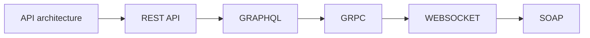

# Api architecture cntent table

- REST api[[REST API]]
- SOAP[[SOAP]]
- GRAPHQL[[GRAPHQL]]
- GRPC[[GRPC]]
- WEBSOCKET[[WEBSOCKET]]

## Complete notes

API architecture is about how different software systems communicate.

## Main types to know

- [[REST API]] is simple and resource-based.
- [[GRAPHQL]] lets client ask for exact data.
- [[GRPC]] is fast and strongly typed.
- [[WEBSOCKET]] is for real-time two-way communication.
- [[SOAP]] is strict and XML-based.

## Choosing API style

- Use REST for normal web/mobile CRUD apps.
- Use GraphQL when frontend needs flexible data.
- Use gRPC for internal high-performance services.
- Use WebSocket for real-time updates.
- Use SOAP when enterprise system requires it.

## Revision dashboard

### Main idea

Choose API style by data shape, performance, real-time needs, and system contract.

### Study order

- [[REST API]]
- [[GRAPHQL]]
- [[GRPC]]
- [[WEBSOCKET]]
- [[SOAP]]

### Diagram

### How to revise this folder

1. Open this content table first.
2. Click each linked topic one by one.
3. Read the `Complete notes` and `Revision notes` sections.
4. Redraw the diagram from memory.
5. Explain one real example without looking.

### Revision checklist

- I can define API architecture in one sentence.
- I can explain each linked note.
- I can draw the topic flow.
- I know one use case.
- I know one common mistake.
