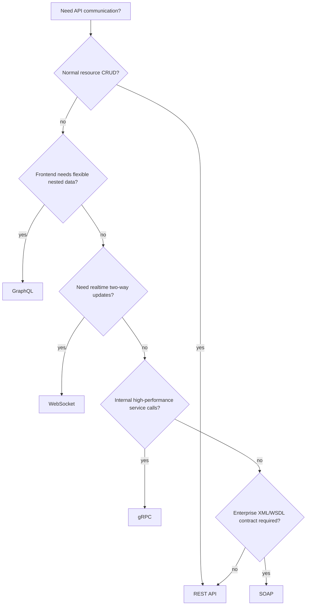

# Api architecture cntent table

API architecture is about choosing how software systems communicate. Start here, then open each linked topic one by one.

## Topic map

- [[REST API]]
- [[GRAPHQL]]
- [[GRPC]]
- [[WEBSOCKET]]
- [[SOAP]]

## Complete notes

A backend API is not only an endpoint. A complete API decision includes protocol, request shape, response shape, schema/contract, auth, errors, versioning, scaling, debugging, and client compatibility.

## Easy explanation

Think of API architecture like choosing the right communication style:

- REST is like asking for resources by URL.
- GraphQL is like asking for exactly the fields you need.
- gRPC is like calling a typed function on another service.
- WebSocket is like keeping a live connection open.
- SOAP is like sending strict XML messages using an enterprise contract.

## Main types to know

| API style | Best for | Format | Communication style | Main risk |
|---|---|---|---|---|
| [[REST API]] | normal web/mobile CRUD APIs | JSON usually | request-response | weak resource design, inconsistent errors |
| [[GRAPHQL]] | flexible nested frontend data | JSON | query/mutation/subscription | N+1 queries, expensive queries, auth mistakes |
| [[GRPC]] | internal service-to-service calls | Protocol Buffers | RPC + streaming | proto compatibility, deadlines, retry storms |
| [[WEBSOCKET]] | realtime two-way updates | text/binary/custom | persistent connection | connection scaling, reconnect storms, backpressure |
| [[SOAP]] | enterprise/legacy contracts | XML | strict message contract | verbose payloads, brittle WSDL/client integration |

## Decision diagram

## Production checklist

For every API style, revise:

1. request/response shape
2. schema or contract
3. authentication and authorization
4. error format and status/fault behavior
5. retries, idempotency, and timeout behavior
6. versioning and backward compatibility
7. rate limiting and abuse protection
8. performance and scaling bottlenecks
9. logs, metrics, traces, and request ids
10. client behavior during failure

## Real-life examples

### Easy example

A shopping app can use [[REST API]] for products and orders because those are clear resources like `/products`, `/cart`, and `/orders`.

### Difficult production example

A large company may use REST for public mobile APIs, [[GRPC]] between internal services, [[WEBSOCKET]] for live order tracking, [[GRAPHQL]] for a complex admin dashboard, and [[SOAP]] for an old banking/payment partner. The senior skill is knowing where each style fits and where it becomes painful.

## Related practical API notes

- [[API Contract Design]]
- [[API Error Handling]]
- [[API Gateway]]
- [[CORS]]
- [[Webhooks]]
- [[Webhook Processing]]
- [[Pagination]]
- [[API Versioning]]
- [[Rate limiting with Redis]]
- [[Authentication vs Authorization]]

## Senior interview bank

### 1. How do you choose between REST, GraphQL, gRPC, WebSocket, and SOAP?

I choose based on the communication problem. REST is the default for resource-based public APIs. GraphQL is useful when clients need flexible nested data. gRPC is strong for internal service-to-service calls with typed contracts and low latency. WebSocket is for realtime bidirectional updates. SOAP is mainly used when a legacy or enterprise partner requires XML/WSDL standards.

### 2. What makes an API architecture production-ready?

A production-ready API has a clear contract, auth, validation, consistent errors, timeouts, retries, idempotency where needed, rate limits, versioning, backward compatibility, observability, and documented failure behavior. The API should be easy for clients to use and safe for the backend to operate.

### 3. What is the biggest beginner mistake?

The mistake is learning definitions only. In interviews, always explain where it sits in the request path, who calls it, what it calls next, whether it is synchronous or asynchronous, what can fail, and what metric you would watch.

## Study order

1. [[REST API]]
2. [[API Contract Design]]
3. [[API Error Handling]]
4. [[API Versioning]]
5. [[Pagination]]
6. [[GRAPHQL]]
7. [[GRPC]]
8. [[WEBSOCKET]]
9. [[SOAP]]
10. [[API Gateway]]
