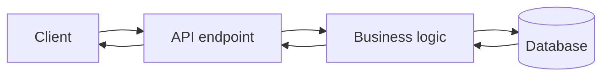

so fronted directly call the data base so there is one connection of data base and the frontend
so frontend has the main control of the things FE has query

so it is a query   language

## why it is used

- over fetching the data
- under fetching the data

## request for Graphql

![[Pasted image 20260907145211.png]]

so a single thing in the code

# How to make a query

![[Pasted image 20260907145713.png]]

![[Pasted image 20260907151856.png]]

## benefit of it

![[Pasted image 20260907145803.png]]

## Revision notes

### What it is

GraphQL lets the client request exactly the data shape it needs from one endpoint.

### Why it matters

- It helps you understand the main job of `GRAPHQL`.
- It gives a mental model for interviews, revision, and building real projects.
- It connects with nearby notes in this vault, so revise it with the content table and related links.

### How to think about it

Ask these questions:

- What problem does it solve?
- What are the main parts?
- What happens step by step?
- Where is it used in real projects?
- What mistake should I avoid?

### Diagram

### Key terms

`Schema`, `Query`, `Mutation`, `Resolver`, `Over-fetching`, `Under-fetching`

### Real project example

In a real app, `GRAPHQL` is not learned alone. It connects with frontend, backend, database, browser, network, and deployment decisions.

Example revision flow:

1. Define the topic in one sentence.
2. Draw the flow from memory.
3. Explain one real use case.
4. Say one advantage.
5. Say one limitation or mistake.

### Common mistakes

- Memorizing the word but not knowing the flow.
- Not knowing when to use it.
- Mixing similar topics without comparing them.
- Forgetting the tradeoff.

### Quick revision

- Main idea: GraphQL lets the client request exactly the data shape it needs from one endpoint.
- Remember the keywords: Schema, Query, Mutation, Resolver.
- Best way to revise: explain it out loud with a small example and the diagram.
