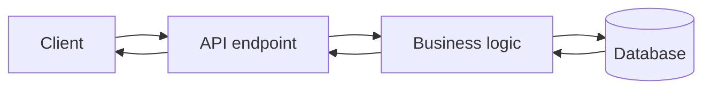
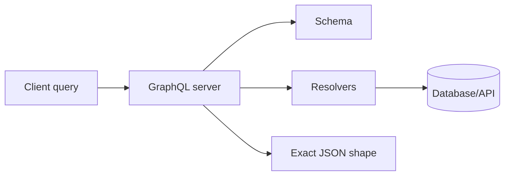

## Easy explanation

GraphQL lets the frontend ask for exactly the fields it needs, like user name plus the titles of recent posts.

In simple words: learn when to use `GRAPHQL`, when not to use it, and what can fail in production.

## Real-life examples

### Easy real-life example

GraphQL lets the frontend ask for exactly the fields it needs, like user name plus the titles of recent posts.

### Difficult production example

A production GraphQL API needs schema governance, resolver performance, query depth/complexity limits, N+1 prevention, caching strategy, auth per field/object, and persisted queries for public clients.

### How to relate this topic

When reading `GRAPHQL`, connect it to:

- request/response shape
- data format
- contract/schema
- error handling
- auth/security
- scaling and debugging

so fronted directly call the data base so there is one connection of data base and the frontend
so frontend has the main control of the things FE has query

so it is a query   language

## why it is used

- over fetching the data
- under fetching the data

## request for Graphql

![[Pasted image 20260907145211.png]]

so a single thing in the code

# How to make a query

![[Pasted image 20260907145713.png]]

![[Pasted image 20260907151856.png]]

## benefit of it

![[Pasted image 20260907145803.png]]

## Revision notes

### What it is

GraphQL lets the client request exactly the data shape it needs from one endpoint.

### Why it matters

- It helps you understand the main job of `GRAPHQL`.
- It gives a mental model for interviews, revision, and building real projects.
- It connects with nearby notes in this vault, so revise it with the content table and related links.

### How to think about it

Ask these questions:

- What problem does it solve?
- What are the main parts?
- What happens step by step?
- Where is it used in real projects?
- What mistake should I avoid?

### Diagram



### Key terms

`Schema`, `Query`, `Mutation`, `Resolver`, `Over-fetching`, `Under-fetching`

### Real project example

In a real app, `GRAPHQL` is not learned alone. It connects with frontend, backend, database, browser, network, and deployment decisions.

Example revision flow:

1. Define the topic in one sentence.
2. Draw the flow from memory.
3. Explain one real use case.
4. Say one advantage.
5. Say one limitation or mistake.

### Common mistakes

- Memorizing the word but not knowing the flow.
- Not knowing when to use it.
- Mixing similar topics without comparing them.
- Forgetting the tradeoff.

### Quick revision

- Main idea: GraphQL lets the client request exactly the data shape it needs from one endpoint.
- Remember the keywords: Schema, Query, Mutation, Resolver.
- Best way to revise: explain it out loud with a small example and the diagram.

## Professional revision notes

### What GraphQL is

GraphQL is an API query language where the client asks for exactly the data it needs.

Instead of many [[REST API|REST]] endpoints, GraphQL commonly exposes one endpoint like:

```text

POST /graphql
```

### GraphQL flow



### Main concepts

- Schema: contract of available data.
- Type: shape of object.
- Query: read data.
- Mutation: create/update/delete data.
- Resolver: function that fetches data for a field.
- Subscription: real-time updates, often over WebSocket.

### Query example

```graphql

query {
  user(id: "10") {
    id
    name
    posts {
      title
    }
  }
}
```

Response:

```json

{
  "data": {
    "user": {
      "id": "10",
      "name": "Priyanshu",
      "posts": [
        { "title": "API notes" }
      ]
    }
  }
}
```

### Mutation example

```graphql

mutation {
  createPost(input: { title: "GraphQL" }) {
    id
    title
  }
}
```

### REST vs GraphQL

| Topic | REST | GraphQL |
|---|---|---|
| Endpoints | many | usually one |
| Data shape | server decides | client asks |
| Over-fetching | common | reduced |
| Under-fetching | common | reduced |
| Caching | simple with HTTP | more custom |
| Learning curve | easy | higher |

### When to use GraphQL

- Frontend needs flexible nested data.
- Many clients need different data shapes.
- Mobile app needs fewer network calls.
- Product has complex relationships between data.

### When to avoid

- Very simple CRUD API.
- Team does not need query flexibility.
- Caching must stay very simple.
- No time to handle query complexity/security.

### Common mistakes

- No query depth/complexity limit.
- N+1 database queries in resolvers.
- Treating GraphQL as magic database.
- No auth checks inside resolvers.

## Senior interview bank

These are topic-specific questions and strong answers for `GRAPHQL`.

### 1. When should you use GraphQL?

Use it when clients need flexible nested data and REST would cause over-fetching or under-fetching.

### 2. What can go wrong?

N+1 queries, expensive nested queries, weak auth at field/object level, cache complexity, and schema breaking changes.

### 3. How do you secure/scale it?

Use depth/complexity limits, persisted queries, batching/dataloaders, resolver metrics, auth per object, and schema governance.
