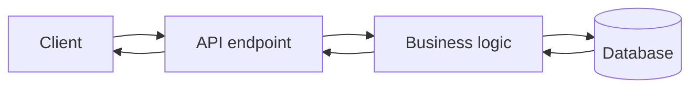
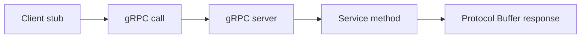
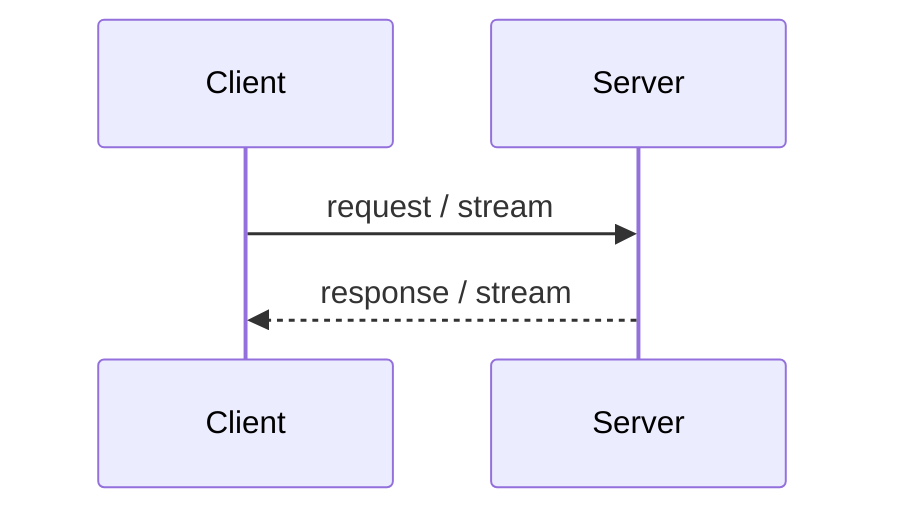

## Easy explanation

gRPC feels like calling a function on another service, but the call goes over the network using a `.proto` contract.

In simple words: learn when to use `GRPC`, when not to use it, and what can fail in production.

## Real-life examples

### Easy real-life example

gRPC feels like calling a function on another service, but the call goes over the network using a `.proto` contract.

### Difficult production example

A production gRPC system needs proto versioning, deadlines, retries, streaming backpressure, service discovery, load balancing, mTLS, observability, and compatibility rules for fields.

### How to relate this topic

When reading `GRPC`, connect it to:

- request/response shape
- data format
- contract/schema
- error handling
- auth/security
- scaling and debugging

it uses Protocol buffers  so instead  of XML and the JSon it uses the Protocol buffers
so this reduced the size of the data so it is important

it use http2 and Protocol buffer

# so what is tha gap that created the GRPC

so wheneverwe sen a request it goes to [[REST API|http]] request
so the http is handled by client library so here if the browser is not upto date then it is a issue

![[Pasted image 20260907152644.png]]

## MODES of gRPC

![[Pasted image 20260907152849.png]]

## Unary RPC

so a client make a request and the server respond with one data so it is synchronous taks

## Server Streaming RPC

so a client make a request and the server respond with multiple data so
youtube

## Client Streaming RPC

client is uploading or sending data to the server
uploading something

## Bidirectional streaming RPC

so  both send data to each other
gaming ot chating

## Revision notes

### What it is

gRPC is a high-performance RPC style API that commonly uses Protocol Buffers.

### Why it matters

- It helps you understand the main job of `GRPC`.
- It gives a mental model for interviews, revision, and building real projects.
- It connects with nearby notes in this vault, so revise it with the content table and related links.

### How to think about it

Ask these questions:

- What problem does it solve?
- What are the main parts?
- What happens step by step?
- Where is it used in real projects?
- What mistake should I avoid?

### Diagram



### Key terms

`proto file`, `service`, `message`, `client stub`, `server implementation`, `streaming`

### Real project example

In a real app, `GRPC` is not learned alone. It connects with frontend, backend, database, browser, network, and deployment decisions.

Example revision flow:

1. Define the topic in one sentence.
2. Draw the flow from memory.
3. Explain one real use case.
4. Say one advantage.
5. Say one limitation or mistake.

### Common mistakes

- Memorizing the word but not knowing the flow.
- Not knowing when to use it.
- Mixing similar topics without comparing them.
- Forgetting the tradeoff.

### Quick revision

- Main idea: gRPC is a high-performance RPC style API that commonly uses Protocol Buffers.
- Remember the keywords: proto file, service, message, client stub.
- Best way to revise: explain it out loud with a small example and the diagram.

## Professional revision notes

### What gRPC is

gRPC is a high-performance RPC framework commonly used for service-to-service communication.

RPC means Remote Procedure Call.

It feels like calling a function, but the function runs on another service/server.

### gRPC architecture



### Protocol Buffers

gRPC commonly uses `.proto` files to define service and message contracts.

Example:

```proto

service UserService {
  rpc GetUser (GetUserRequest) returns (User);
}

message GetUserRequest {
  string id = 1;
}

message User {
  string id = 1;
  string name = 2;
}
```

### Types of gRPC calls

| Type | Meaning | Example |
|---|---|---|
| Unary | one request, one response | get user |
| Server streaming | one request, many responses | live logs |
| Client streaming | many requests, one response | upload chunks |
| Bidirectional streaming | both send streams | chat/live sync |

### gRPC streaming diagram



### Why gRPC is fast

- Uses Protocol Buffers, which are compact binary format.
- Usually runs over HTTP/2.
- Supports multiplexing and streaming.
- Strong contract from `.proto`.

### When to use gRPC

- Microservices/internal services.
- Low-latency communication.
- Strong typed contracts.
- Streaming between services.
- Polyglot systems where services use different languages.

### When not to use

- Simple public browser API.
- Basic CRUD app.
- Team wants easy browser debugging.
- Need human-readable JSON by default.

### REST vs gRPC

| Topic | REST | gRPC |
|---|---|---|
| Style | resource based | function/service based |
| Format | JSON usually | Protocol Buffers |
| Browser use | easy | harder/direct support limited |
| Performance | good | very high |
| Best for | public APIs | internal services |

### Common mistakes

- Using gRPC for simple frontend API without reason.
- Not versioning `.proto` carefully.
- Breaking backward compatibility.
- Ignoring deadlines/timeouts.

## Senior interview bank

These are topic-specific questions and strong answers for `GRPC`.

### 1. When should you use gRPC?

Use it for internal service-to-service calls needing strong contracts, low latency, streaming, and typed schemas.

### 2. What can go wrong?

Proto compatibility breaks, missing deadlines, retry storms, streaming backpressure issues, and browser/client ecosystem friction.

### 3. How do you operate it?

Use deadlines, mTLS, service discovery, load balancing, observability, proto versioning, and careful retry policies.
