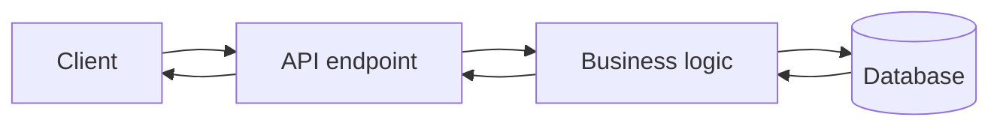

it uses Protocol buffers  so instead  of XML and the JSon it uses the Protocol buffers
so this reduced the size of the data so it is important

it use http2 and Protocol buffer

# so what is tha gap that created the GRPC

so wheneverwe sen a request it goes to http request
so the http is handled by client library so here if the browser is not upto date then it is a issue

![[Pasted image 20260907152644.png]]

## MODES of gRPC

![[Pasted image 20260907152849.png]]

## Unary RPC

so a client make a request and the server respond with one data so it is synchronous taks

## Server Streaming RPC

so a client make a request and the server respond with multiple data so
youtube

## Client Streaming RPC

client is uploading or sending data to the server
uploading something

## Bidirectional streaming RPC

so  both send data to each other
gaming ot chating

## Revision notes

### What it is

gRPC is a high-performance RPC style API that commonly uses Protocol Buffers.

### Why it matters

- It helps you understand the main job of `GRPC`.
- It gives a mental model for interviews, revision, and building real projects.
- It connects with nearby notes in this vault, so revise it with the content table and related links.

### How to think about it

Ask these questions:

- What problem does it solve?
- What are the main parts?
- What happens step by step?
- Where is it used in real projects?
- What mistake should I avoid?

### Diagram

### Key terms

`proto file`, `service`, `message`, `client stub`, `server implementation`, `streaming`

### Real project example

In a real app, `GRPC` is not learned alone. It connects with frontend, backend, database, browser, network, and deployment decisions.

Example revision flow:

1. Define the topic in one sentence.
2. Draw the flow from memory.
3. Explain one real use case.
4. Say one advantage.
5. Say one limitation or mistake.

### Common mistakes

- Memorizing the word but not knowing the flow.
- Not knowing when to use it.
- Mixing similar topics without comparing them.
- Forgetting the tradeoff.

### Quick revision

- Main idea: gRPC is a high-performance RPC style API that commonly uses Protocol Buffers.
- Remember the keywords: proto file, service, message, client stub.
- Best way to revise: explain it out loud with a small example and the diagram.
