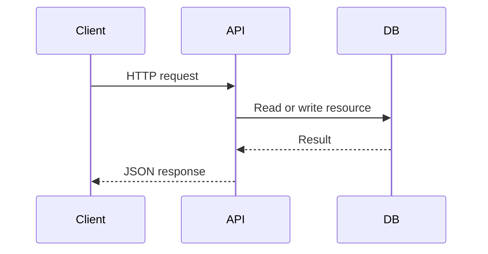
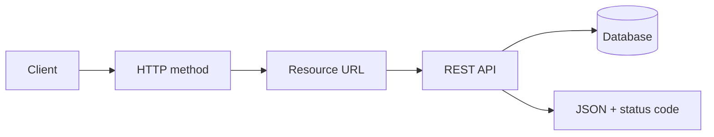

## Easy explanation

REST is like a menu of URLs. The client asks for `/products/123`, and the server returns JSON for that product.

In simple words: learn when to use `REST API`, when not to use it, and what can fail in production.

## Real-life examples

### Easy real-life example

REST is like a menu of URLs. The client asks for `/products/123`, and the server returns JSON for that product.

### Difficult production example

A production REST API needs resource naming, correct HTTP methods, status codes, validation, pagination, idempotency for unsafe writes, rate limits, auth, versioning, and consistent error responses.

### How to relate this topic

When reading `REST API`, connect it to:

- request/response shape
- data format
- contract/schema
- error handling
- auth/security
- scaling and debugging

http and work with JSON

## so what it has

- HTTP method
- Endpoint
- JSON response
- http resposne

![[Pasted image 20260907141713.png]]

Difference between query parameter and path parameter

![[Pasted image 20260907141906.png]]

so nesting of data can notwe loo long params instaad of that we the filtering of the data so make a guey and then used filterling to same date

## Tyee of the passing data to server

- PATH
- BODy
- Query Params

## query params

it is optional so it is sued to to filter out something

# Path

so we send url/id
so it is used to identify any thing so a url and all

![[Pasted image 20260907145002.png]]

## Revision notes

### What it is

REST API exposes resources through URLs and uses HTTP methods for actions.

### Why it matters

- It helps you understand the main job of `REST API`.
- It gives a mental model for interviews, revision, and building real projects.
- It connects with nearby notes in this vault, so revise it with the content table and related links.

### How to think about it

Ask these questions:

- What problem does it solve?
- What are the main parts?
- What happens step by step?
- Where is it used in real projects?
- What mistake should I avoid?

### Diagram



### Key terms

`resource`, `endpoint`, `GET`, `POST`, `PATCH`, `DELETE`

### Real project example

In a real app, `REST API` is not learned alone. It connects with frontend, backend, database, browser, network, and deployment decisions.

Example revision flow:

1. Define the topic in one sentence.
2. Draw the flow from memory.
3. Explain one real use case.
4. Say one advantage.
5. Say one limitation or mistake.

### Common mistakes

- Memorizing the word but not knowing the flow.
- Not knowing when to use it.
- Mixing similar topics without comparing them.
- Forgetting the tradeoff.

### Quick revision

- Main idea: REST API exposes resources through URLs and uses HTTP methods for actions.
- Remember the keywords: resource, endpoint, GET, POST.
- Best way to revise: explain it out loud with a small example and the diagram.

## Professional revision notes

### What REST is

REST is an API architectural style based on resources.

A resource is a thing like user, product, order, post, payment, or file.

REST uses URLs to identify resources and HTTP methods to perform actions.

### REST mental model



### HTTP methods

| Method | Meaning | Example |
|---|---|---|
| GET | read data | `GET /users/10` |
| POST | create data/action | `POST /users` |
| PUT | replace full resource | `PUT /users/10` |
| PATCH | update part of resource | `PATCH /users/10` |
| DELETE | delete resource | `DELETE /users/10` |

### Status codes

| Code | Meaning |
|---|---|
| 200 | OK |
| 201 | Created |
| 204 | Success with no body |
| 400 | Bad request |
| 401 | Not authenticated |
| 403 | Not allowed |
| 404 | Not found |
| 409 | Conflict |
| 429 | Rate limited |
| 500 | Server error |

### Example API design

```text

GET    /products
GET    /products/:id
POST   /products
PATCH  /products/:id
DELETE /products/:id
```

### REST best practices

- Use nouns in URLs, not verbs.
- Use HTTP methods for actions.
- Use status codes correctly.
- Use consistent error format.
- Add pagination for lists.
- Add filtering/sorting when needed.
- Version public APIs.
- Use auth middleware for protected resources.

### Good error format

```json

{
  "error": {
    "code": "PRODUCT_NOT_FOUND",
    "message": "Product not found"
  }
}
```

### When to use REST

- CRUD apps.
- Mobile/web backend.
- Public APIs.
- Admin dashboards.
- Simple frontend-backend communication.

### When REST is weak

- Frontend needs many nested resources in one request.
- Real-time communication.
- High-performance internal service calls.

### Common mistakes

- Using `POST /getUsers` instead of `GET /users`.
- Returning 200 for every response, even errors.
- No pagination.
- Inconsistent response shapes.
- No idempotency for payment/order creation.

## Senior interview bank

These are topic-specific questions and strong answers for `REST API`.

### 1. When should you use REST?

Use REST for resource-based web/mobile APIs where CRUD, JSON, HTTP methods, and status codes are natural.

### 2. What makes a REST API production-ready?

Clear resource URLs, correct methods/status codes, validation, auth, pagination, idempotency, versioning, rate limits, and consistent errors.

### 3. What is the trap?

Treating REST as only `GET/POST`. Senior answers discuss resource modeling, safe/idempotent methods, caching, status codes, and contracts.
