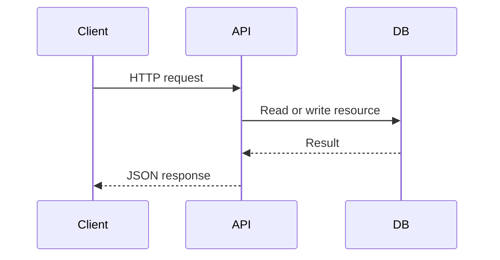

http and work with JSON

## so what it has

- HTTP method
- Endpoint
- JSON response
- http resposne

![[Pasted image 20260907141713.png]]

Difference between query parameter and path parameter

![[Pasted image 20260907141906.png]]

so nesting of data can notwe loo long params instaad of that we the filtering of the data so make a guey and then used filterling to same date

## Tyee of the passing data to server

- PATH
- BODy
- Query Params

## query params

it is optional so it is sued to to filter out something

# Path

so we send url/id
so it is used to identify any thing so a url and all

![[Pasted image 20260907145002.png]]

## Revision notes

### What it is

REST API exposes resources through URLs and uses HTTP methods for actions.

### Why it matters

- It helps you understand the main job of `REST API`.
- It gives a mental model for interviews, revision, and building real projects.
- It connects with nearby notes in this vault, so revise it with the content table and related links.

### How to think about it

Ask these questions:

- What problem does it solve?
- What are the main parts?
- What happens step by step?
- Where is it used in real projects?
- What mistake should I avoid?

### Diagram

### Key terms

`resource`, `endpoint`, `GET`, `POST`, `PATCH`, `DELETE`

### Real project example

In a real app, `REST API` is not learned alone. It connects with frontend, backend, database, browser, network, and deployment decisions.

Example revision flow:

1. Define the topic in one sentence.
2. Draw the flow from memory.
3. Explain one real use case.
4. Say one advantage.
5. Say one limitation or mistake.

### Common mistakes

- Memorizing the word but not knowing the flow.
- Not knowing when to use it.
- Mixing similar topics without comparing them.
- Forgetting the tradeoff.

### Quick revision

- Main idea: REST API exposes resources through URLs and uses HTTP methods for actions.
- Remember the keywords: resource, endpoint, GET, POST.
- Best way to revise: explain it out loud with a small example and the diagram.
