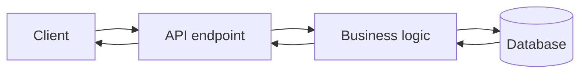

# SOAP

work with XML

## Complete notes

SOAP means Simple Object Access Protocol.

- It is a strict API style that usually sends data as XML.
- It often uses HTTP, but it can also work with other protocols.
- It is common in banking, enterprise systems, old payment systems, and government integrations.
- SOAP has a formal contract called WSDL. The WSDL tells the client what methods exist and what request/response shape is expected.

## SOAP vs REST

- SOAP is protocol-based and strict.
- REST is architecture-style and more flexible.
- SOAP mostly uses XML.
- REST commonly uses JSON.
- SOAP has built-in standards for security, transactions, and reliability.

## Simple idea

If REST feels like asking for resources, SOAP feels like calling formal functions on a remote service.

## Revision notes

### What it is

SOAP is a strict XML-based protocol often used in enterprise integrations.

### Why it matters

- It helps you understand the main job of `SOAP`.
- It gives a mental model for interviews, revision, and building real projects.
- It connects with nearby notes in this vault, so revise it with the content table and related links.

### How to think about it

Ask these questions:

- What problem does it solve?
- What are the main parts?
- What happens step by step?
- Where is it used in real projects?
- What mistake should I avoid?

### Diagram

### Key terms

`XML envelope`, `WSDL`, `operation`, `contract`, `security`

### Real project example

In a real app, `SOAP` is not learned alone. It connects with frontend, backend, database, browser, network, and deployment decisions.

Example revision flow:

1. Define the topic in one sentence.
2. Draw the flow from memory.
3. Explain one real use case.
4. Say one advantage.
5. Say one limitation or mistake.

### Common mistakes

- Memorizing the word but not knowing the flow.
- Not knowing when to use it.
- Mixing similar topics without comparing them.
- Forgetting the tradeoff.

### Quick revision

- Main idea: SOAP is a strict XML-based protocol often used in enterprise integrations.
- Remember the keywords: XML envelope, WSDL, operation, contract.
- Best way to revise: explain it out loud with a small example and the diagram.
