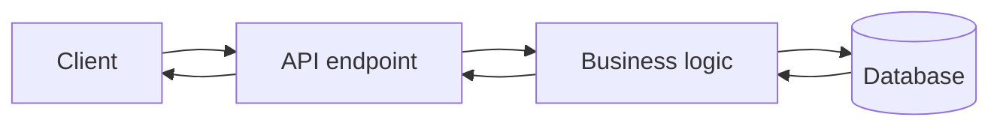
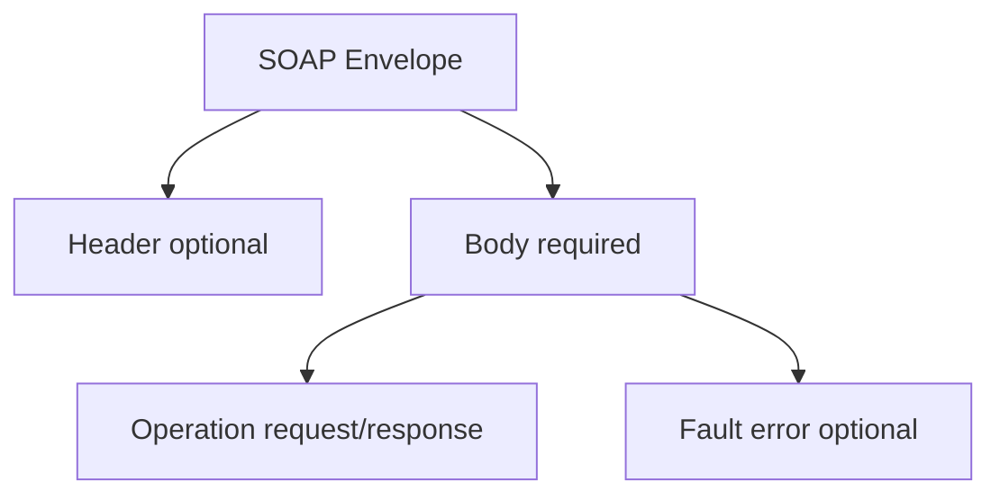

# SOAP

work with XML

## Complete notes

SOAP means Simple Object Access Protocol.

- It is a strict API style that usually sends data as XML.
- It often uses HTTP, but it can also work with other protocols.
- It is common in banking, enterprise systems, old payment systems, and government integrations.
- SOAP has a formal contract called WSDL. The WSDL tells the client what methods exist and what request/response shape is expected.

## Easy explanation

SOAP is like sending a strict XML envelope to an enterprise service that follows a formal WSDL contract.

In simple words: learn when to use `SOAP`, when not to use it, and what can fail in production.

## Real-life examples

### Easy real-life example

SOAP is like sending a strict XML envelope to an enterprise service that follows a formal WSDL contract.

### Difficult production example

A production SOAP integration needs WSDL contract handling, XML validation, SOAP Fault parsing, WS-Security, idempotency, timeouts, retries, audit logs, and compatibility with legacy systems.

### How to relate this topic

When reading `SOAP`, connect it to:

- request/response shape
- data format
- contract/schema
- error handling
- auth/security
- scaling and debugging

## SOAP vs REST

- SOAP is protocol-based and strict.
- REST is architecture-style and more flexible.
- SOAP mostly uses XML.
- REST commonly uses JSON.
- SOAP has built-in standards for security, transactions, and reliability.

## Simple idea

If [[REST API|REST]] feels like asking for resources, SOAP feels like calling formal functions on a remote service.

## Revision notes

### What it is

SOAP is a strict XML-based protocol often used in enterprise integrations.

### Why it matters

- It helps you understand the main job of `SOAP`.
- It gives a mental model for interviews, revision, and building real projects.
- It connects with nearby notes in this vault, so revise it with the content table and related links.

### How to think about it

Ask these questions:

- What problem does it solve?
- What are the main parts?
- What happens step by step?
- Where is it used in real projects?
- What mistake should I avoid?

### Diagram



### Key terms

`XML envelope`, `WSDL`, `operation`, `contract`, `security`

### Real project example

In a real app, `SOAP` is not learned alone. It connects with frontend, backend, database, browser, network, and deployment decisions.

Example revision flow:

1. Define the topic in one sentence.
2. Draw the flow from memory.
3. Explain one real use case.
4. Say one advantage.
5. Say one limitation or mistake.

### Common mistakes

- Memorizing the word but not knowing the flow.
- Not knowing when to use it.
- Mixing similar topics without comparing them.
- Forgetting the tradeoff.

### Quick revision

- Main idea: SOAP is a strict XML-based protocol often used in enterprise integrations.
- Remember the keywords: XML envelope, WSDL, operation, contract.
- Best way to revise: explain it out loud with a small example and the diagram.

## Professional revision notes

### What SOAP is

SOAP is an XML-based messaging protocol for exchanging structured information.

It is stricter than REST and common in enterprise, banking, telecom, insurance, and legacy integrations.

### SOAP message structure



### SOAP XML example

```xml

<soap:Envelope xmlns:soap="http://www.w3.org/2003/05/soap-envelope">
  <soap:Header>
    <!-- auth/security metadata -->
  </soap:Header>
  <soap:Body>
    <GetUser>
      <id>10</id>
    </GetUser>
  </soap:Body>
</soap:Envelope>
```

### WSDL

WSDL describes the SOAP service contract.

It tells clients:

- available operations
- input/output XML shape
- endpoint URL
- binding/protocol details

### SOAP vs REST

| Topic | SOAP | REST |
|---|---|---|
| Type | protocol | architectural style |
| Format | XML | JSON commonly |
| Contract | WSDL | OpenAPI often |
| Strictness | high | flexible |
| Browser/frontend use | uncommon | common |
| Enterprise standards | strong | lighter |

### When to use SOAP

- Enterprise integration requires it.
- Banking/payment/insurance system uses WSDL.
- Need strict XML contract.
- Legacy system already exposes SOAP.

### When not to use

- Modern web/mobile CRUD app.
- Simple public JSON API.
- Frontend needs lightweight data.

### SOAP fault

SOAP errors are usually returned as SOAP Fault inside XML.

### Common mistakes

- Thinking SOAP is same as REST.
- Ignoring WSDL contract.
- Trying to manually build XML without schema validation.
- Using SOAP in a modern app when REST/GraphQL is enough.

## Senior interview bank

These are topic-specific questions and strong answers for `SOAP`.

### 1. When should you use SOAP?

Use it when an enterprise/legacy/banking/government integration requires WSDL, XML, and SOAP standards.

### 2. What can go wrong?

XML schema mismatch, SOAP Fault handling, WS-Security config, brittle generated clients, timeouts, and verbose payloads.

### 3. How do you operate it?

Validate WSDL contracts, parse SOAP faults, log request ids, set timeouts/retries, and test against provider sandbox.
