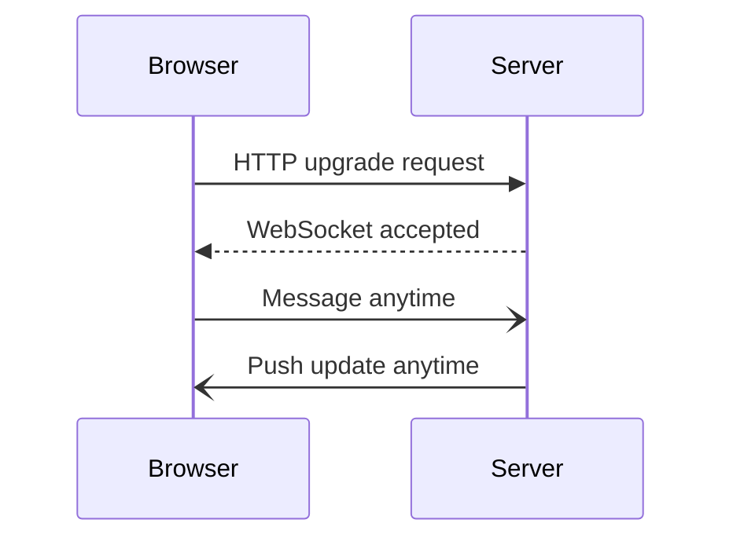
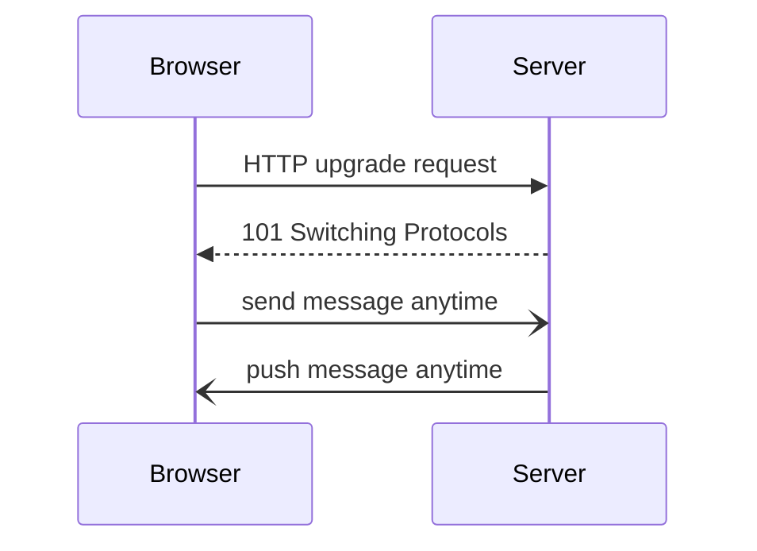
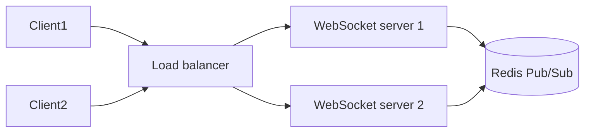

# WEBSOCKET

Bi directional response so the backend can also send data to the FE without getting ay request so it is helpful  the connection is maintained

real time application

## Complete notes

WebSocket is used when the client and server need a continuous two-way connection.

- HTTP request is normally one request and one response.
- WebSocket keeps the connection open.
- Server can send data to the client without waiting for a new request.
- It is useful for chat apps, live notifications, multiplayer games, stock prices, dashboards, and collaborative editors.

## Easy explanation

WebSocket is like keeping a phone call open between browser and server, so both can speak anytime.

In simple words: learn when to use `WEBSOCKET`, when not to use it, and what can fail in production.

## Real-life examples

### Easy real-life example

WebSocket is like keeping a phone call open between browser and server, so both can speak anytime.

### Difficult production example

A production WebSocket system needs authentication on connect, heartbeat/ping-pong, reconnect logic, connection limits, fanout through pub/sub, sticky routing or shared broker, backpressure, and message versioning.

### How to relate this topic

When reading `WEBSOCKET`, connect it to:

- request/response shape
- data format
- contract/schema
- error handling
- auth/security
- scaling and debugging

## Flow

1. Browser starts with an [[REST API|HTTP]] request.
2. Server upgrades the connection to WebSocket.
3. Both sides can send messages anytime.
4. Connection stays open until one side closes it.

## When not to use

- Normal CRUD APIs.
- Static content.
- Simple form submit.
- Data that only changes rarely.

## Revision notes

### What it is

WebSocket keeps a two-way connection open so client and server can send messages anytime.

### Why it matters

- It helps you understand the main job of `WEBSOCKET`.
- It gives a mental model for interviews, revision, and building real projects.
- It connects with nearby notes in this vault, so revise it with the content table and related links.

### How to think about it

Ask these questions:

- What problem does it solve?
- What are the main parts?
- What happens step by step?
- Where is it used in real projects?
- What mistake should I avoid?

### Diagram

### Key terms

`upgrade`, `persistent connection`, `real-time`, `event`, `message`

### Real project example

In a real app, `WEBSOCKET` is not learned alone. It connects with frontend, backend, database, browser, network, and deployment decisions.

Example revision flow:

1. Define the topic in one sentence.
2. Draw the flow from memory.
3. Explain one real use case.
4. Say one advantage.
5. Say one limitation or mistake.

### Common mistakes

- Memorizing the word but not knowing the flow.
- Not knowing when to use it.
- Mixing similar topics without comparing them.
- Forgetting the tradeoff.

### Quick revision

- Main idea: WebSocket keeps a two-way connection open so client and server can send messages anytime.
- Remember the keywords: upgrade, persistent connection, real-time, event.
- Best way to revise: explain it out loud with a small example and the diagram.

## Professional revision notes

### What WebSocket is

WebSocket creates a persistent two-way connection between client and server.

Normal HTTP is request-response.

WebSocket stays open, so both sides can send messages anytime.

### WebSocket flow

### When WebSocket is useful

- Chat apps.
- Multiplayer games.
- Live notifications.
- Live location tracking.
- Trading/stock prices.
- Collaborative editing.
- Real-time dashboards.

### WebSocket vs HTTP polling

| Topic | Polling | WebSocket |
|---|---|---|
| Connection | repeated HTTP requests | one persistent connection |
| Server push | no, client asks repeatedly | yes |
| Latency | higher | lower |
| Complexity | simple | more complex |
| Scaling | easier | needs connection management |

### WebSocket scaling

### Important production details

- Heartbeat/ping-pong to detect dead connections.
- Auth during connection setup.
- Reconnect logic on frontend.
- Message schema/versioning.
- Backpressure when messages are too fast.
- Horizontal scaling with Redis Pub/Sub or message broker.

### WebSocket vs Server-Sent Events

| Topic | WebSocket | SSE |
|---|---|---|
| Direction | two-way | server to client |
| Protocol | WebSocket | HTTP |
| Best for | chat/games/collab | notifications/live feed |

### Common mistakes

- Using WebSocket for normal CRUD.
- No reconnect strategy.
- No heartbeat.
- No auth check.
- Not planning horizontal scaling.

## Senior interview bank

These are topic-specific questions and strong answers for `WEBSOCKET`.

### 1. When should you use WebSocket?

Use it for real-time bidirectional updates like chat, live notifications, games, dashboards, and collaboration.

### 2. What can go wrong?

Connection leaks, missing heartbeat, reconnect storms, auth expiry, message ordering, backpressure, and fanout scaling.

### 3. How do you scale it?

Use shared pub/sub or broker, connection limits, heartbeat, sticky routing or shared state, backpressure, and message schema versioning.
