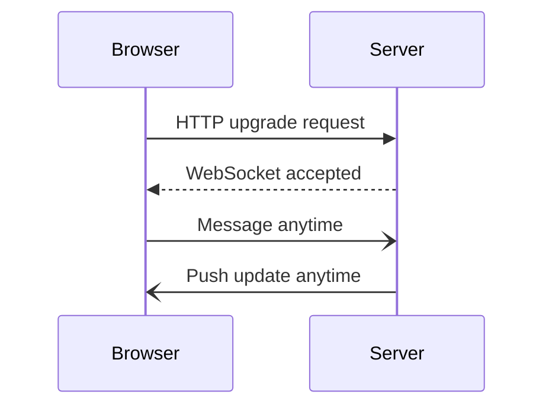

# WEBSOCKET

Bi directional response so the backend can also send data to the FE without getting ay request so it is helpful  the connection is maintained

real time application

## Complete notes

WebSocket is used when the client and server need a continuous two-way connection.

- HTTP request is normally one request and one response.
- WebSocket keeps the connection open.
- Server can send data to the client without waiting for a new request.
- It is useful for chat apps, live notifications, multiplayer games, stock prices, dashboards, and collaborative editors.

## Flow

1. Browser starts with an HTTP request.
2. Server upgrades the connection to WebSocket.
3. Both sides can send messages anytime.
4. Connection stays open until one side closes it.

## When not to use

- Normal CRUD APIs.
- Static content.
- Simple form submit.
- Data that only changes rarely.

## Revision notes

### What it is

WebSocket keeps a two-way connection open so client and server can send messages anytime.

### Why it matters

- It helps you understand the main job of `WEBSOCKET`.
- It gives a mental model for interviews, revision, and building real projects.
- It connects with nearby notes in this vault, so revise it with the content table and related links.

### How to think about it

Ask these questions:

- What problem does it solve?
- What are the main parts?
- What happens step by step?
- Where is it used in real projects?
- What mistake should I avoid?

### Diagram

### Key terms

`upgrade`, `persistent connection`, `real-time`, `event`, `message`

### Real project example

In a real app, `WEBSOCKET` is not learned alone. It connects with frontend, backend, database, browser, network, and deployment decisions.

Example revision flow:

1. Define the topic in one sentence.
2. Draw the flow from memory.
3. Explain one real use case.
4. Say one advantage.
5. Say one limitation or mistake.

### Common mistakes

- Memorizing the word but not knowing the flow.
- Not knowing when to use it.
- Mixing similar topics without comparing them.
- Forgetting the tradeoff.

### Quick revision

- Main idea: WebSocket keeps a two-way connection open so client and server can send messages anytime.
- Remember the keywords: upgrade, persistent connection, real-time, event.
- Best way to revise: explain it out loud with a small example and the diagram.
