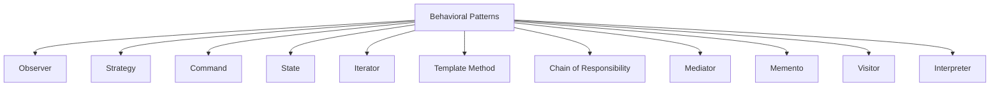

# Behavioral Patterns in Go

## Complete notes

Behavioral patterns are about communication, responsibility, and workflow between objects.

They answer this question:

```text
How should components communicate and decide who does what?
```

## Why this matters

Most backend bugs come from workflow and responsibility confusion:

- who validates?
- who retries?
- who publishes events?
- who owns state transitions?
- who chooses the algorithm?
- who handles failure?

Behavioral patterns make these responsibilities explicit.

## Subtopics

| Pattern                 | Core purpose                                    | Real-world analogy                          | Go note                                   |
| ----------------------- | ----------------------------------------------- | ------------------------------------------- | ----------------------------------------- |
| Observer                | Notifies subscribers when state changes         | YouTube subscribers get video notification  | [[Observer Pattern in Go]]                |
| Strategy                | Swaps algorithms at runtime                     | GPS changes driving/walking route           | [[Strategy Pattern in Go]]                |
| Command                 | Turns an action into an executable object       | waiter sends order ticket to kitchen        | [[Command Pattern in Go]]                 |
| State                   | Behavior changes with internal state            | vending machine changes after coin inserted | [[State Pattern in Go]]                   |
| Iterator                | Traverses collection without exposing internals | flipping pages in a book                    | [[Iterator Pattern in Go]]                |
| Template Method         | Fixed algorithm skeleton with variable steps    | house blueprint with customizable parts     | [[Template Method Pattern in Go]]         |
| Chain of Responsibility | Passes request through handlers                 | support hotline routing                     | [[Chain of Responsibility Pattern in Go]] |
| Mediator                | Coordinates objects through central mediator    | airport control tower                       | [[Mediator Pattern in Go]]                |
| Memento                 | Saves/restores internal state                   | Ctrl+Z undo                                 | [[Memento Pattern in Go]]                 |
| Visitor                 | Adds operations over object structure           | tax auditor visits different shops          | [[Visitor Pattern in Go]]                 |
| Interpreter             | Evaluates expressions/rules                     | reading musical notation                    | [[Interpreter Pattern in Go]]             |

## Diagram



## Backend examples

| Pattern | Backend example |
|---|---|
| Observer | order.created triggers notification/audit/analytics |
| Strategy | choose store/rider/pricing/rate limit algorithm |
| Command | background job or retryable admin action |
| State | order/payment/delivery lifecycle |
| Iterator | paginated report export |
| Template Method | import pipeline parse -> validate -> save |
| Chain of Responsibility | checkout validation pipeline |
| Mediator | checkout orchestration between services |
| Memento | draft invoice undo/restore |
| Visitor | category-specific tax calculation |
| Interpreter | dynamic product filter rules |

## How to choose

```mermaid
flowchart TD
  Need[Need behavior design?] --> Algo[Multiple algorithms?]
  Algo -->|yes| Strategy[Use Strategy]
  Need --> Event[Many things react to event?]
  Event -->|yes| Observer[Use Observer]
  Need --> Job[Action must be queued/retried/undone?]
  Job -->|yes| Command[Use Command]
  Need --> Life[Lifecycle with valid transitions?]
  Life -->|yes| State[Use State]
  Need --> Traverse[Need sequential traversal?]
  Traverse -->|yes| Iterator[Use Iterator]
  Need --> Workflow[Same workflow, variable steps?]
  Workflow -->|yes| Template[Use Template Method]
  Need --> Pipeline[Request passes through handlers?]
  Pipeline -->|yes| Chain[Use Chain of Responsibility]
  Need --> Coordination[Many components coordinate?]
  Coordination -->|yes| Mediator[Use Mediator]
  Need --> Undo[Need undo/restore?]
  Undo -->|yes| Memento[Use Memento]
  Need --> Ops[Many operations over stable structure?]
  Ops -->|yes| Visitor[Use Visitor]
  Need --> Rules[Need expression/rule evaluation?]
  Rules -->|yes| Interpreter[Use Interpreter]
```



## Go implementation style

| Pattern | Idiomatic Go style |
|---|---|
| Strategy | small interface with multiple implementations |
| Observer | event bus, channels, callbacks, outbox in production |
| Command | `Execute(ctx)` job object/function |
| State | enum + transition rules or state interface |
| Iterator | `Next/HasNext`, callback, channel, or paginated scanner |
| Template Method | workflow function calling interface steps |
| Chain | slice of validators/middleware handlers |
| Mediator | orchestrator service coordinating components |
| Memento | snapshot struct with restore method |
| Visitor | interface for operations over stable node types |
| Interpreter | expression tree implementing `Match/Eval` |

## Zepto-style example

For inventory/order assignment:

- Strategy chooses dark store.
- State controls order lifecycle.
- Observer publishes `order.created`.
- Chain validates checkout request.
- Command represents retryable cancellation/refund job.
- Mediator coordinates inventory/payment/order when the workflow becomes complex.

## What to say in interview

Behavioral patterns help separate workflow decisions from domain data. In Go, they are usually implemented with interfaces, function types, channels/events, and explicit service methods.

## Senior explanation

Behavioral patterns should make the workflow easier to reason about. If a pattern hides the failure path or makes the order of operations unclear, it is hurting the design. In backend LLD, always explain error handling, retries, idempotency, and state transitions.

## Common mistakes

- making too many tiny abstractions
- hiding failure paths in events
- no idempotency in commands/events
- using patterns instead of straightforward code
