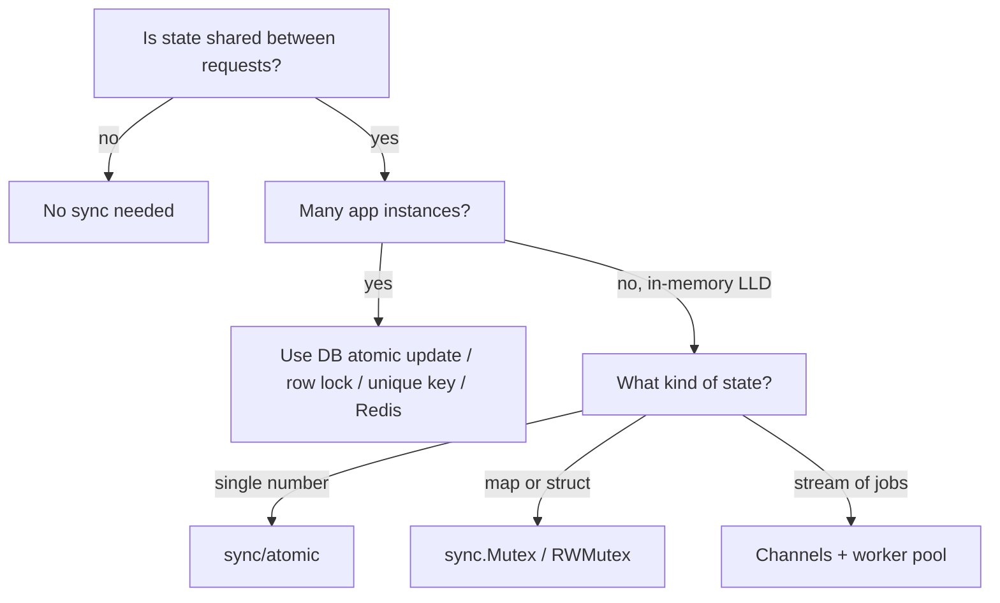

# Concurrency in Go LLD

## Complete notes

Almost every LLD follow-up becomes a concurrency question:

- two users book the last seat
- two riders get assigned the same order
- two requests decrement the same stock
- a cache/map is read and written by many HTTP requests

In Go, every HTTP request runs in its own goroutine. So any struct shared between requests (service, in-memory repo, cache, event bus) is shared between goroutines. If it holds mutable state, it needs protection.

The interviewer wants to hear three things:

1. **Where** is the shared mutable state?
2. **What** protects it (mutex, atomic, channel, or the database)?
3. **What happens** when two requests collide (one wins, other gets a clear error)?

## Decision table

| Situation | Use | Why |
|---|---|---|
| shared map/struct inside one process | `sync.Mutex` / `sync.RWMutex` | simplest, clearest |
| read-heavy shared data | `sync.RWMutex` | many readers in parallel |
| single counter/flag | `sync/atomic` (`atomic.Int64`) | no lock needed |
| one-time init (config, client) | `sync.Once` | safe lazy init, see [[Singleton Pattern in Go]] |
| pipeline / worker pool / fan-out | channels + goroutines | passing work between goroutines |
| wait for N goroutines | `sync.WaitGroup` or `errgroup.Group` | join + first error |
| timeout / cancellation | `context.Context` | stop work the caller no longer needs |
| state shared across **multiple servers** | database (conditional UPDATE, row lock, unique constraint) or Redis | a Go mutex only protects one process |

Rule from Go proverbs: *"Don't communicate by sharing memory; share memory by communicating."* But for guarding a map or a struct, a mutex is simpler and perfectly idiomatic. Do not force channels where a mutex fits.

## Diagram



## 1. Mutex: protect shared state

```go
package inventory

import (
    "errors"
    "sync"
)

var ErrOutOfStock = errors.New("out of stock")

type Store struct {
    mu    sync.Mutex
    stock map[string]int // productID -> available qty
}

func NewStore() *Store {
    return &Store{stock: make(map[string]int)}
}

func (s *Store) Add(productID string, qty int) {
    s.mu.Lock()
    defer s.mu.Unlock()
    s.stock[productID] += qty
}

// Reserve is check-then-act. Both steps must be inside ONE lock,
// otherwise two goroutines both see qty=1 and both reserve it.
func (s *Store) Reserve(productID string, qty int) error {
    s.mu.Lock()
    defer s.mu.Unlock()
    if s.stock[productID] < qty {
        return ErrOutOfStock
    }
    s.stock[productID] -= qty
    return nil
}
```

The classic bug is **check-then-act across two lock sections**:

```text
lock; read qty; unlock      <- goroutine A sees 1
lock; read qty; unlock      <- goroutine B sees 1
lock; qty -= 1; unlock      <- A takes it
lock; qty -= 1; unlock      <- B takes it -> stock = -1 (oversold)
```

## 2. Multi-resource locking: avoid deadlock

When one operation needs several locks (e.g. lock 3 seats, transfer between 2 wallets), always take them in a **fixed global order** (sorted by ID).

```go
package wallet

import (
    "errors"
    "sync"
)

var ErrInsufficientFunds = errors.New("insufficient funds")

type Wallet struct {
    ID      string
    mu      sync.Mutex
    Balance int64 // paise
}

// Transfer locks wallets in ID order, so A->B and B->A at the same time
// cannot deadlock.
func Transfer(from, to *Wallet, amount int64) error {
    if from.ID == to.ID {
        return nil
    }
    first, second := from, to
    if second.ID < first.ID {
        first, second = second, first
    }
    first.mu.Lock()
    defer first.mu.Unlock()
    second.mu.Lock()
    defer second.mu.Unlock()

    if from.Balance < amount {
        return ErrInsufficientFunds
    }
    from.Balance -= amount
    to.Balance += amount
    return nil
}
```

## 3. Worker pool with channels and context

Use when work is a stream of independent jobs (send notifications, process webhooks, resize images).

```go
package worker

import (
    "context"
    "sync"
)

type Job struct {
    ID      string
    Payload string
}

type Processor func(ctx context.Context, job Job) error

type Pool struct {
    jobs    chan Job
    workers int
    process Processor
    wg      sync.WaitGroup
}

func NewPool(workers, queueSize int, process Processor) *Pool {
    return &Pool{jobs: make(chan Job, queueSize), workers: workers, process: process}
}

func (p *Pool) Start(ctx context.Context) {
    for i := 0; i < p.workers; i++ {
        p.wg.Add(1)
        go func() {
            defer p.wg.Done()
            for {
                select {
                case <-ctx.Done():
                    return
                case job, ok := <-p.jobs:
                    if !ok {
                        return
                    }
                    _ = p.process(ctx, job) // real code: log + retry/DLQ
                }
            }
        }()
    }
}

// Submit returns false instead of blocking forever when the queue is full
// (backpressure: caller can return 429 or persist the job).
func (p *Pool) Submit(job Job) bool {
    select {
    case p.jobs <- job:
        return true
    default:
        return false
    }
}

// Stop closes the queue and waits for in-flight jobs. Call Submit before Stop only.
func (p *Pool) Stop() {
    close(p.jobs)
    p.wg.Wait()
}
```

## 4. Atomic counter

```go
package metrics

import "sync/atomic"

type Counter struct {
    n atomic.Int64
}

func (c *Counter) Inc() int64  { return c.n.Add(1) }
func (c *Counter) Value() int64 { return c.n.Load() }
```

Atomics are only for a **single** value. If two fields must change together, use a mutex.

## 5. When the mutex is not enough: the database

In a real backend you run many instances of the service. A `sync.Mutex` in instance A does not stop instance B. Move the guarantee to the shared store:

| Technique | Example | Use when |
|---|---|---|
| conditional UPDATE | `UPDATE inventory SET qty = qty - $1 WHERE id = $2 AND qty >= $1` -> rows affected 0 means fail | counters, stock |
| row lock | `SELECT ... FOR UPDATE` inside a transaction | read-modify-write on few rows |
| optimistic lock | `UPDATE ... SET version = version + 1 WHERE id = $1 AND version = $2` | low contention, retry on conflict |
| unique constraint | `UNIQUE(show_id, seat_id)` on confirmed bookings | "only one can win" invariants |
| idempotency key | `UNIQUE(idempotency_key)` | client/network retries |
| Redis lock / Lua script | `SET key val NX PX 30000` | short holds like seat locks, rate limits |

Interview line:

```text
In the in-memory version I protect the map with a mutex. In production with multiple instances I would move the invariant to the database with a conditional update or unique constraint, because a Go mutex only protects one process.
```

## Go tools you should mention

- `go test -race ./...` finds data races in tests (see [[Testing LLD Code in Go]]).
- `sync.RWMutex` when reads dominate.
- `errgroup.Group` (`golang.org/x/sync/errgroup`) for parallel calls with first-error cancel.
- `singleflight.Group` (`golang.org/x/sync/singleflight`) to collapse duplicate cache misses.
- `context.WithTimeout` on every outbound call.

## Where this shows up in practice notes

| Problem | Shared state | Protection |
|---|---|---|
| [[Inventory Order Assignment LLD in Go]] | stock per store | conditional UPDATE |
| [[Movie Ticket Booking LLD in Go]] | seat status | lock seats in sorted order + unique constraint |
| [[Parking Lot LLD in Go]] | free spots | mutex around find+assign |
| [[Rate Limiter LLD in Go]] | tokens per key | mutex per bucket / Redis Lua |
| [[LRU Cache LLD in Go]] | map + list | one mutex (Get also mutates order) |
| [[Notification System LLD in Go]] | job queue | channels + worker pool |
| [[Library Management LLD in Go]] | available copies | mutex / conditional UPDATE |

## Interview answer

```text
Every HTTP request in Go is a goroutine, so any service state shared between requests needs protection. For in-memory state I use a mutex and keep check-and-update inside one critical section. For multiple locks I lock in sorted order to avoid deadlock. For background work I use a worker pool with a bounded channel and context cancellation. In production, invariants like "no overselling" live in the database through conditional updates or unique constraints, and I run tests with -race.
```

## Common mistakes

- check and update in two separate lock sections (oversell)
- forgetting `RLock` on reads because "reads are safe" (concurrent map read + write is a fatal error in Go)
- copying a struct that contains a `sync.Mutex` (pass pointers; `go vet` catches this)
- calling external services (payment, HTTP) while holding a lock
- locking multiple resources in random order (deadlock)
- unbounded goroutines per request instead of a worker pool
- goroutine leak: no `ctx.Done()` case, nobody closes the channel
- using a Go mutex to protect data shared across multiple service instances

## Quick revision

```text
shared state? -> mutex (one process) / DB or Redis (many processes)
check-then-act -> one critical section
many locks -> sorted order
stream of jobs -> bounded channel + workers + context
always -> go test -race
```

## Sources

- Go memory model: https://go.dev/ref/mem
- sync package: https://pkg.go.dev/sync
- Race detector: https://go.dev/doc/articles/race_detector
- Go concurrency patterns, pipelines: https://go.dev/blog/pipelines
