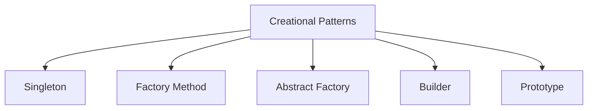
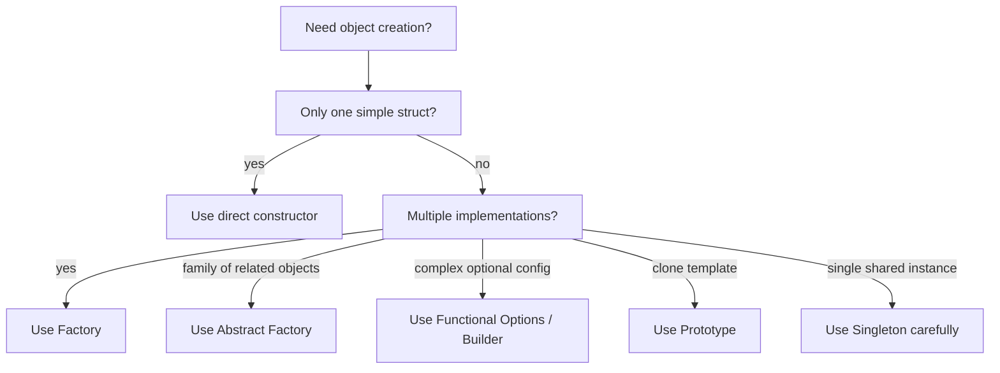

# Creational Patterns in Go

## Complete notes

Creational patterns are about object creation.

In interviews, if someone asks, "What are the main design pattern categories?" answer:

```text
1. Creational: object creation
2. Structural: object/class composition
3. Behavioral: communication and responsibility
```

Creational patterns answer this question:

```text
How should objects be created without making the code rigid or messy?
```

## Why this matters

Object creation looks simple at first:

```go
notifier := EmailNotifier{}
```

But in real backend systems, creation often depends on config, environment, provider, tenant, feature flag, or test setup.

Examples:

- use Razorpay in India, Stripe in US
- use mock payment gateway in tests
- create API clients with timeout/retry/logger
- create recurring invoice from template
- create Redis/Postgres clients only once

Creational patterns keep this creation logic away from business services.

## Subtopics

| Pattern | Core purpose | Real-world analogy | Go note |
|---|---|---|---|
| Singleton | Ensures only one global instance | single DB connection pool/config | [[Singleton Pattern in Go]] |
| Factory Method | Creates objects through a common creation function/interface | logistics app creates truck or ship | [[Factory Pattern in Go]] |
| Abstract Factory | Creates families of related objects | matching dark-mode UI controls | [[Abstract Factory Pattern in Go]] |
| Builder | Builds complex objects step by step | custom pizza order | [[Builder and Functional Options Pattern in Go]] |
| Prototype | Creates new objects by cloning a template | copy-paste a complex drawing shape | [[Prototype Pattern in Go]] |

## Diagram



## Backend examples

| Pattern | Backend example |
|---|---|
| Singleton | config/logger/metrics registry |
| Factory | create notifier/payment provider by type |
| Abstract Factory | create complete Razorpay/Stripe provider family |
| Builder | configurable API client with timeout/retries |
| Prototype | recurring invoice template clone |

## How to choose



## Go implementation style

| Pattern | Idiomatic Go style |
|---|---|
| Singleton | `sync.Once`, package-level guarded instance |
| Factory | `NewX(kind string) (Interface, error)` |
| Abstract Factory | provider factory returning related interfaces |
| Builder | functional options like `WithTimeout(...)` |
| Prototype | `Clone()` with deep copy |

## Zepto-style example

For a checkout system:

- Factory creates notification sender: push/SMS/email.
- Abstract Factory creates payment provider family: charge/refund/webhook verifier.
- Builder configures external delivery API client.
- Prototype clones recurring campaign/order template.
- Singleton can hold config/logger, not request-specific data.

## What to say in interview

Creational patterns help decouple object creation from business logic. In Go, they are usually implemented using constructor functions, interfaces, `sync.Once`, or functional options.

## Senior explanation

I do not add creational patterns just for pattern names. I add them when creation logic itself becomes a source of change. If object construction is simple, I keep it direct. If creation depends on provider/config/family/optional settings, I move it behind a factory or builder so services stay focused on business logic.

## Common mistakes

- overusing factories for simple structs
- using singleton as global mutable state
- copying Java constructors directly into Go
- forgetting deep copy in Prototype
