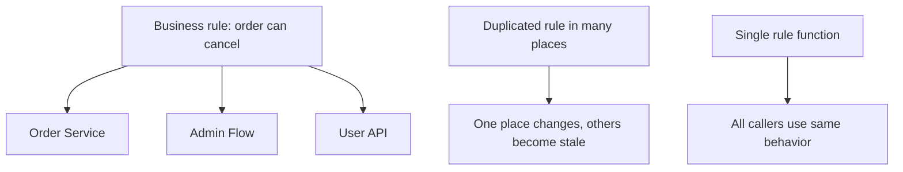

# DRY Principle in Go LLD

## Complete notes

DRY means Do Not Repeat Yourself.

The real meaning is not "never write similar-looking code." The real meaning is:

```text
Do not duplicate the same knowledge or business rule in multiple places.
```

If the same rule exists in two places, one place will eventually change and the other will become wrong.

## Simple example

Bad:

```go
func CanCancelFromOrderPage(status string) bool {
    return status == "created" || status == "reserved"
}

func CanCancelFromAdminPage(status string) bool {
    return status == "created" || status == "reserved"
}
```

The cancellation rule is duplicated.

Better:

```go
type OrderStatus string

const (
    Created  OrderStatus = "created"
    Reserved OrderStatus = "reserved"
    Paid     OrderStatus = "paid"
)

func CanCancel(status OrderStatus) bool {
    return status == Created || status == Reserved
}
```

Now the business rule has one owner.

## Diagram



## DRY in backend LLD

Use DRY for:

- validation rules
- state transition rules
- pricing formulas
- tax calculation
- permission checks
- retry/idempotency logic
- API error response shape
- DB transaction helpers

## DRY with design patterns

| Problem | Pattern that can help |
|---|---|
| repeated validation steps | Chain of Responsibility |
| repeated object creation logic | Factory |
| repeated workflow skeleton | Template Method |
| repeated middleware concerns | Decorator/Middleware |
| repeated external SDK handling | Adapter |

## When DRY can hurt

Do not merge code only because it looks similar. Two code blocks may look similar today but represent different business concepts.

Bad abstraction example:

```text
Order cancellation validation and payment refund validation both check status, but the business rules may evolve differently.
```

If concepts change independently, keep them separate.

## Interview answer

DRY means avoiding duplicated knowledge, not blindly removing every repeated line. In LLD, I centralize business rules like state transitions, validation, and pricing so the system has one source of truth.

## Common mistakes

- abstracting too early
- creating generic helper names like `ProcessData`
- merging unrelated concepts
- making one giant utility package
- hiding business meaning behind clever abstraction

## Quick revision

DRY is about one source of truth for one business rule.
