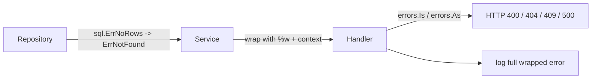

# Error Handling and Interfaces in Go LLD

## Complete notes

Two Go-specific things interviewers notice right away in LLD code:

1. **How you design interfaces.** Small, defined where they are used, satisfied implicitly.
2. **How you handle errors.** Domain errors the caller can check, wrapped with context, mapped to HTTP status only at the edge.

Java habits (big interfaces declared up front, exceptions for flow control, `IService`/`ServiceImpl` pairs) look wrong in Go.

## Part 1: Interfaces

### Rules

| Rule | Meaning |
|---|---|
| Keep interfaces small | 1-3 methods. `io.Reader` has one method. |
| Define at the consumer | the package that *uses* the dependency declares the interface it needs |
| Accept interfaces, return structs | constructors take interfaces, return concrete `*Service` |
| Implicit satisfaction | no `implements` keyword; any type with the methods fits |
| No interface for one implementation | unless you need it for tests or a real boundary (DB, external API) |

### Consumer-side interface

```go
package checkout

import "context"

// checkout only needs Reserve, so it declares only Reserve.
// The inventory package's concrete type has 10 methods; it still satisfies this.
type StockReserver interface {
    Reserve(ctx context.Context, storeID, productID string, qty int) error
}

type PaymentCharger interface {
    Charge(ctx context.Context, userID string, amount int64) (string, error)
}

type Service struct {
    stock   StockReserver
    payment PaymentCharger
}

// accept interfaces, return a concrete struct
func NewService(stock StockReserver, payment PaymentCharger) *Service {
    return &Service{stock: stock, payment: payment}
}
```

Benefits: tests pass a 5-line fake, and `checkout` does not import every method of `inventory`. This is the Interface Segregation and Dependency Inversion parts of [[SOLID Principles in Go LLD]].

### Compile-time check

```go
var _ StockReserver = (*PostgresInventory)(nil) // fails to compile if methods drift
```

### Embedding for composition

```go
type Reader interface{ Read(ctx context.Context, id string) (Order, error) }
type Writer interface{ Save(ctx context.Context, o Order) error }

type ReadWriter interface {
    Reader
    Writer
}
```

### Generics vs interfaces

- Use **interfaces** when *behavior* varies (strategy, provider, repository).
- Use **generics** when the *algorithm is the same* for many types (LRU cache, set, queue, `Map/Filter` helpers). Example: `LRU[K comparable, V any]` in [[LRU Cache LLD in Go]].

## Part 2: Errors

### Three kinds of errors

| Kind | Go form | Caller checks with |
|---|---|---|
| sentinel (fixed condition) | `var ErrNotFound = errors.New("not found")` | `errors.Is(err, ErrNotFound)` |
| typed (carries data) | `type ValidationError struct{ Field string }` | `errors.As(err, &ve)` |
| wrapped (adds context) | `fmt.Errorf("reserve seat %s: %w", id, err)` | `Is`/`As` still see the cause through `%w` |

### Domain errors package

```go
package booking

import (
    "errors"
    "fmt"
)

var (
    ErrNotFound          = errors.New("not found")
    ErrSeatUnavailable   = errors.New("seat unavailable")
    ErrInvalidTransition = errors.New("invalid state transition")
)

type ValidationError struct {
    Field  string
    Reason string
}

func (e *ValidationError) Error() string {
    return fmt.Sprintf("invalid %s: %s", e.Field, e.Reason)
}

func LockSeat(showID, seatID string, taken map[string]bool) error {
    if seatID == "" {
        return &ValidationError{Field: "seat_id", Reason: "required"}
    }
    if taken[seatID] {
        // wrap: keep the sentinel, add context for logs
        return fmt.Errorf("lock seat %s on show %s: %w", seatID, showID, ErrSeatUnavailable)
    }
    taken[seatID] = true
    return nil
}
```

### Map errors to HTTP only at the handler

The service returns domain errors. The handler decides the status code. The service never imports `net/http`.

```go
package booking

import (
    "errors"
    "net/http"
)

func HTTPStatus(err error) int {
    var ve *ValidationError
    switch {
    case err == nil:
        return http.StatusOK
    case errors.As(err, &ve):
        return http.StatusBadRequest
    case errors.Is(err, ErrNotFound):
        return http.StatusNotFound
    case errors.Is(err, ErrSeatUnavailable), errors.Is(err, ErrInvalidTransition):
        return http.StatusConflict
    default:
        return http.StatusInternalServerError
    }
}
```

## Diagram



## Real-life example

In seat booking, `LockSeats` returns `ErrSeatUnavailable` wrapped with show and seat IDs. Logs show `lock seat A7 on show 42: seat unavailable`. The client gets `409 Conflict` with a clean message. The DB driver error never reaches the client.

## Interview answer

```text
I keep interfaces small and define them in the package that uses them, so each service depends only on what it calls and tests can pass simple fakes. Constructors accept interfaces and return concrete structs. For errors I use sentinel errors for known domain conditions, typed errors when I need data such as which field failed, and wrap with %w for context. The handler maps errors to HTTP codes using errors.Is and errors.As, so business code stays transport-agnostic.
```

## Common mistakes

- `IOrderService` + `OrderServiceImpl` Java-style pairs
- one giant `Repository` interface with 20 methods
- comparing errors with `==` after wrapping (use `errors.Is`)
- `fmt.Errorf("...: %v", err)` loses the chain; use `%w`
- returning `http.StatusConflict` or Gin types from the service layer
- leaking `sql.ErrNoRows` or driver errors to API clients
- `panic` for business errors (panic is for programmer bugs only)
- ignoring errors with `_ =` without a comment explaining why

## Quick revision

```text
small interface, at consumer, accept interface / return struct
sentinel -> errors.Is, typed -> errors.As, context -> %w
map to HTTP at the edge only
```

## Sources

- Effective Go, interfaces: https://go.dev/doc/effective_go#interfaces
- Working with errors in Go 1.13+: https://go.dev/blog/go1.13-errors
- Go Code Review Comments, interfaces: https://go.dev/wiki/CodeReviewComments#interfaces
