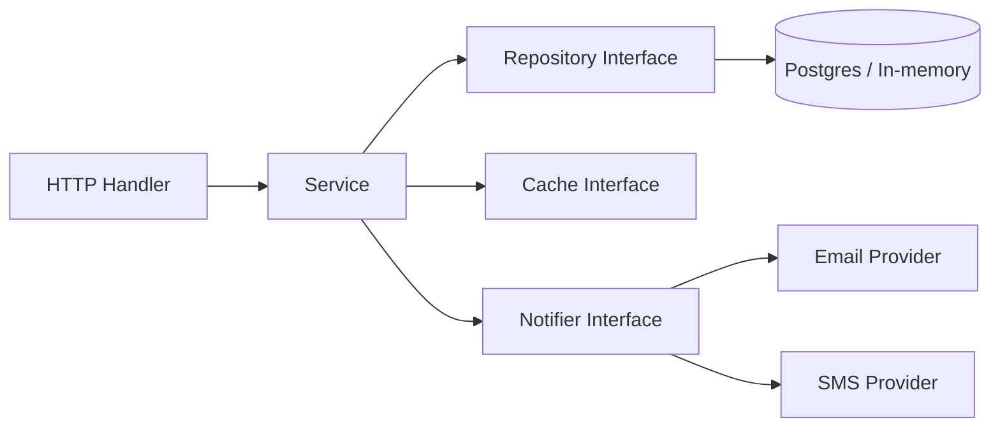

# Go LLD Mental Model

## Complete notes

Low Level Design in Go is possible, but it should look like Go, not Java copied into Go.

Go does not have classes or inheritance. Go designs with:

- `struct` for data and behavior
- `interface` for behavior contracts
- composition instead of inheritance
- constructor functions like `NewOrderService(...)`
- packages for boundaries
- `context.Context` for request timeout/cancellation
- errors as explicit return values
- goroutines/channels only when concurrency is really needed

## Java/OOP to Go translation

| OOP idea | Go version |
|---|---|
| class | struct + methods |
| interface | interface |
| constructor | `NewX(...)` function |
| inheritance | embedding/composition |
| abstract class | interface + shared helper struct if needed |
| method override | different struct implementing same interface |
| dependency injection | pass dependency into constructor |
| package/module | Go package |

## Diagram



## Go backend layering

```text
cmd/api/main.go
internal/order/handler.go
internal/order/service.go
internal/order/repository.go
internal/order/model.go
internal/order/errors.go
```

The handler should not contain business logic. The repository should not decide business rules. The service coordinates the use case.

## Go code example

```go
type OrderRepository interface {
    Save(ctx context.Context, order *Order) error
    FindByID(ctx context.Context, id string) (*Order, error)
}

type OrderService struct {
    orders OrderRepository
}

func NewOrderService(orders OrderRepository) *OrderService {
    return &OrderService{orders: orders}
}

func (s *OrderService) GetOrder(ctx context.Context, id string) (*Order, error) {
    if id == "" {
        return nil, errors.New("order id is required")
    }
    return s.orders.FindByID(ctx, id)
}
```

## Real-life example

In InvoiceOps or Zepto-like systems, `OrderService` should not know whether data is stored in Postgres, MongoDB, or memory. It asks an `OrderRepository`. That makes tests easier and lets you switch storage without rewriting business logic.

## When to use interfaces

Use interfaces when:

- you need to mock in tests
- multiple implementations exist
- the service should not depend on a concrete provider
- you are integrating external systems

Avoid interfaces when there is only one concrete implementation and no testing/extensibility benefit.

## Common mistakes

- creating giant interfaces with many methods
- placing interfaces in the producer package too early
- copying Java inheritance into Go
- using global singletons everywhere
- using channels for simple synchronous calls
- hiding errors instead of returning them

## Interview answer

In Go, I model LLD with structs, small interfaces, constructor-based dependency injection, and composition. I keep the handler, service, repository, and external providers separate so the code is testable and easy to extend.

## Sources

- Effective Go: https://go.dev/doc/effective_go
- Context package: https://pkg.go.dev/context
