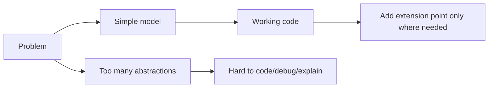

# KISS Principle in Go LLD

## Complete notes

KISS means Keep It Simple, Stupid.

In LLD, it means the design should be easy to explain, easy to code, and easy to change.

A simple design is not a weak design. A simple design solves the current problem clearly without hiding the logic behind unnecessary layers.

## Why KISS matters

Interviewers prefer a working, understandable design over a complex design that is impossible to finish in time.

Bad sign:

```text
I added factory + abstract factory + strategy + observer + mediator, but I cannot explain the core flow.
```

Good sign:

```text
I have clear entities, services, repositories, core methods, and I use Strategy only where the algorithm may change.
```

## Diagram



## Go example

Bad:

```go
type OrderCreationAbstractFactoryProviderRegistry interface {
    ResolveOrderCreationPipelineFactory(kind string) any
}
```

Better:

```go
type OrderService struct {
    orders    OrderRepository
    inventory InventoryRepository
}
```

Start direct. Add abstractions only when the design pressure is real.

## KISS in Go

Go already pushes you toward KISS:

- small interfaces
- simple structs
- explicit errors
- composition over inheritance
- direct control flow
- fewer framework layers

## When simplicity is not enough

KISS does not mean ignoring real complexity. If there are multiple algorithms, use Strategy. If there is a workflow with many validators, use Chain. If external SDKs are messy, use Adapter.

The rule is:

```text
Simple first, extensible where the requirement demands it.
```

## Interview answer

I follow KISS by starting with the simplest design that satisfies the use cases, then adding patterns only where they reduce real complexity. In Go, that usually means small structs, small interfaces, constructor injection, and clear error handling.

## Common mistakes

- confusing simple with incomplete
- adding patterns just to name them
- making one giant service because it feels simple
- hiding important edge cases to keep code short

## Quick revision

KISS means the design should be obvious enough that another engineer can maintain it after the interview.
