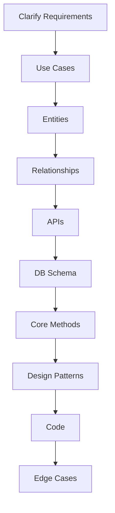

# LLD Interview Approach in Go

## Complete notes

A strong LLD answer is not just code. It is a structured path from problem to implementation.

Use this order:

```text
Requirements -> Use cases -> Entities -> Relationships -> APIs -> DB schema -> Core methods -> Patterns -> Code -> Edge cases
```

## Diagram



## Step 1: Clarify requirements

Ask:

- What are the main actors?
- What are the main actions?
- What is in scope/out of scope?
- Is persistence required?
- Is concurrency important?
- Do we need APIs and DB schema?

Example for movie booking:

```text
Can users lock multiple seats? How long does a lock last? Can booking be cancelled? What happens if payment fails?
```

## Step 2: Define use cases

Use cases are user-visible flows:

- book seats
- cancel booking
- search shows
- make payment
- send confirmation

Do not start with classes before use cases are clear.

## Step 3: Identify entities

Entities are nouns in the problem:

```text
User, Movie, Theater, Screen, Seat, Show, Booking, Payment
```

For Zepto:

```text
User, Store, Product, Inventory, Cart, Order, Payment, DeliveryPartner
```

## Step 4: Define relationships

Examples:

- Theater has many Screens.
- Screen has many Seats.
- Show belongs to Movie and Screen.
- Booking belongs to User and Show.
- Booking has many Seats.

## Step 5: Define core methods

Core methods are the heart of the problem:

```go
LockSeats(ctx, showID, userID string, seatIDs []string) error
CreateBooking(ctx, userID, showID string, seatIDs []string) (Booking, error)
CancelBooking(ctx, bookingID string) error
```

## Step 6: Pick patterns only where useful

| Problem | Pattern |
|---|---|
| seat/order lifecycle | State |
| payment/notification provider | Factory / Adapter |
| pricing or assignment algorithm | Strategy |
| validation pipeline | Chain of Responsibility |
| booking event notification | Observer |
| storage abstraction | Repository |

## Step 7: Code the critical method

In most interviews, code the hardest method, not every class.

Examples:

- `lockSeats`
- `reserveInventory`
- `assignDeliveryPartner`
- `createBooking`
- `rateLimitAllow`

## Step 8: Discuss edge cases

Always mention:

- concurrency
- retries/idempotency
- invalid input
- state transition errors
- payment failure
- partial failure
- timeout/cancellation

## Go-specific structure

```text
model.go      -> structs/enums
repository.go -> storage interfaces
service.go   -> business logic
handler.go   -> API boundary
errors.go    -> domain errors
```

## Interview script

```text
I will first clarify use cases, then identify entities and relationships. After that I will define APIs and DB schema if needed, then focus on the core methods. I will keep the code simple and apply patterns only where they solve a real extension or maintainability problem.
```

## Common mistakes

- jumping directly to code
- listing patterns without use case
- spending too much time on all fields/getters/setters
- no concurrency discussion
- no edge cases
- no core method implementation

## Sources

- CodeWithAryan LLD approach: https://codewitharyan.com/tech-blogs/how-to-approach-lld-problems
- CodeWithAryan LLD basics: https://codewitharyan.com/tech-blogs/what-is-low-level-system-design
