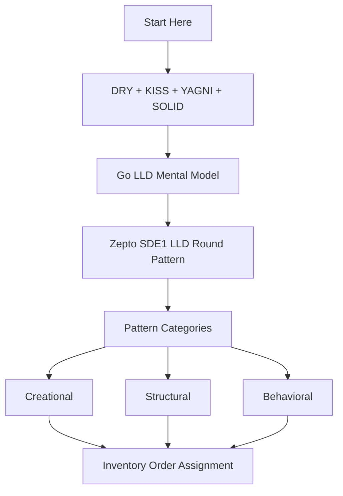

# LLD with Go - START HERE

## What this section is for

This section is for learning Low Level Design using Go in an interview-ready way.

The goal is not to memorize pattern names. The goal is:

- understand the problem
- model entities clearly
- design APIs and DB schema when needed
- write Go code that is clean and extensible
- explain tradeoffs in interview
- handle follow-up requirements without rewriting everything

## Correct study flow

Start with principles, then learn patterns.

```text
DRY + KISS + YAGNI + SOLID
-> LLD interview approach
-> Go LLD mental model
-> Zepto round structure
-> Creational / Structural / Behavioral patterns
-> Practice problems
```

## Main principle answer

If interviewer asks about good LLD principles, say:

1. [[DRY Principle in Go LLD]] - keep one source of truth for business rules
2. [[KISS Principle in Go LLD]] - keep the design simple and maintainable
3. [[YAGNI Principle in Go LLD]] - avoid unnecessary abstractions
4. [[SOLID Principles in Go LLD]] - keep responsibilities and dependencies clean

## Main category answer

If interviewer asks design pattern categories, say:

1. [[Creational Patterns in Go]] - object creation
2. [[Structural Patterns in Go]] - object/component composition
3. [[Behavioral Patterns in Go]] - communication and responsibility

Then give examples from each category.

## Study order

1. [[LLD with Go Content Table]]
2. [[CodeWithAryan LLD Playlist Coverage Map]]
3. [[DRY Principle in Go LLD]]
4. [[KISS Principle in Go LLD]]
5. [[YAGNI Principle in Go LLD]]
6. [[SOLID Principles in Go LLD]]
7. [[LLD Interview Approach in Go]]
8. [[Go LLD Mental Model]]
9. [[Zepto SDE1 LLD Round Pattern]]
7. [[Creational Patterns in Go]]
8. [[Structural Patterns in Go]]
9. [[Behavioral Patterns in Go]]
10. [[Strategy Pattern in Go]]
11. [[Factory Pattern in Go]]
12. [[State Pattern in Go]]
13. [[Observer Pattern in Go]]
14. [[Repository Pattern in Go]]
15. [[Facade Pattern in Go]]
16. [[Inventory Order Assignment LLD in Go]]

## Visual roadmap



## Complete pattern set

After the high-frequency Zepto patterns, complete the full GoF coverage here:

- [[Abstract Factory Pattern in Go]]
- [[Prototype Pattern in Go]]
- [[Composite Pattern in Go]]
- [[Bridge Pattern in Go]]
- [[Flyweight Pattern in Go]]
- [[Proxy Pattern in Go]]
- [[Command Pattern in Go]]
- [[Iterator Pattern in Go]]
- [[Template Method Pattern in Go]]
- [[Mediator Pattern in Go]]
- [[Memento Pattern in Go]]
- [[Visitor Pattern in Go]]
- [[Interpreter Pattern in Go]]

## Practice problems from course style

- [[Inventory Order Assignment LLD in Go]]
- [[Logging System LLD in Go]]

## How to revise

For every pattern, answer:

1. What problem does it solve?
2. What Go feature implements it?
3. Where would I use it in backend?
4. What is the smallest code example?
5. What is one Zepto-style follow-up?
6. What is the mistake to avoid?

## Quick rule

In Go, prefer simple composition first. Use a named pattern only when it removes real complexity.

## Sources

- Go Effective Go: https://go.dev/doc/effective_go
- Go testing docs: https://go.dev/doc/tutorial/add-a-test
- Go context package: https://pkg.go.dev/context
