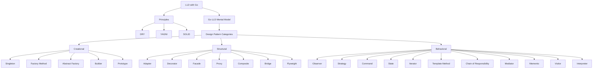

# LLD with Go Content Table

## Main path

Start here and follow in order:

1. [[LLD with Go - START HERE]]
2. [[CodeWithAryan LLD Playlist Coverage Map]]
3. [[DRY Principle in Go LLD]]
4. [[KISS Principle in Go LLD]]
5. [[YAGNI Principle in Go LLD]]
6. [[SOLID Principles in Go LLD]]
7. [[LLD Interview Approach in Go]]
8. [[Go LLD Mental Model]]
9. [[Zepto SDE1 LLD Round Pattern]]
10. [[Creational Patterns in Go]]
11. [[Structural Patterns in Go]]
12. [[Behavioral Patterns in Go]]
13. [[Inventory Order Assignment LLD in Go]]
14. [[Logging System LLD in Go]]

## First answer in interview

If someone asks "what are design patterns?", answer:

```text
Design patterns are reusable solutions to common design problems. They are grouped into Creational, Structural, and Behavioral patterns.
```

If someone asks "what principles should guide LLD?", answer:

```text
DRY avoids duplicated knowledge, YAGNI avoids overengineering, and SOLID keeps responsibilities and dependencies clean.
```

## Principles before patterns

| Principle | Meaning | Go note |
|---|---|---|
| DRY | avoid duplicated business knowledge | [[DRY Principle in Go LLD]] |
| KISS | keep design simple and maintainable | [[KISS Principle in Go LLD]] |
| YAGNI | do not build unnecessary future complexity | [[YAGNI Principle in Go LLD]] |
| SOLID | responsibility/dependency design rules | [[SOLID Principles in Go LLD]] |

## Main design pattern categories

If someone asks "what are the main design pattern categories?", answer these first:

1. [[Creational Patterns in Go]] - object creation mechanisms
2. [[Structural Patterns in Go]] - assembling objects/classes/components
3. [[Behavioral Patterns in Go]] - communication and responsibility

## Complete structure



## Creational patterns

| Pattern | Core purpose | Go note |
|---|---|---|
| Singleton | one shared instance | [[Singleton Pattern in Go]] |
| Factory Method | create object through common creator | [[Factory Pattern in Go]] |
| Abstract Factory | create family of related objects | [[Abstract Factory Pattern in Go]] |
| Builder | construct complex object step by step | [[Builder and Functional Options Pattern in Go]] |
| Prototype | clone from existing template | [[Prototype Pattern in Go]] |

## Structural patterns

| Pattern | Core purpose | Go note |
|---|---|---|
| Adapter | make incompatible interfaces work | [[Adapter Pattern in Go]] |
| Decorator | add behavior around object/function | [[Decorator Middleware Pattern in Go]] |
| Facade | simple API over complex subsystem | [[Facade Pattern in Go]] |
| Proxy | control access/lazy/cache another object | [[Proxy Pattern in Go]] |
| Composite | tree of objects and groups | [[Composite Pattern in Go]] |
| Bridge | separate abstraction and implementation | [[Bridge Pattern in Go]] |
| Flyweight | share common state to save memory | [[Flyweight Pattern in Go]] |

## Behavioral patterns

| Pattern | Core purpose | Go note |
|---|---|---|
| Observer | notify subscribers of events | [[Observer Pattern in Go]] |
| Strategy | swap algorithms | [[Strategy Pattern in Go]] |
| Command | represent action as object/job | [[Command Pattern in Go]] |
| State | behavior changes by state | [[State Pattern in Go]] |
| Iterator | traverse without exposing internals | [[Iterator Pattern in Go]] |
| Template Method | fixed workflow with variable steps | [[Template Method Pattern in Go]] |
| Chain of Responsibility | pass request through handlers | [[Chain of Responsibility Pattern in Go]] |
| Mediator | central coordination between components | [[Mediator Pattern in Go]] |
| Memento | save/restore state | [[Memento Pattern in Go]] |
| Visitor | separate operation from object structure | [[Visitor Pattern in Go]] |
| Interpreter | evaluate expressions/rules | [[Interpreter Pattern in Go]] |

## Backend-specific patterns

These are not all GoF patterns, but they matter in Go backend LLD:

- [[Repository Pattern in Go]]
- [[Facade Pattern in Go]]
- [[Decorator Middleware Pattern in Go]]
- [[Strategy Pattern in Go]]
- [[Observer Pattern in Go]]

## Practice problems

- [[Inventory Order Assignment LLD in Go]]
- [[Logging System LLD in Go]]

## What each pattern maps to in backend

| Pattern | Backend use | Zepto-style example |
|---|---|---|
| Strategy | swap algorithms | choose dark store / delivery partner |
| Factory | create implementations | create payment/notification provider |
| State | lifecycle transitions | order placed -> packed -> delivered |
| Observer | event notification | order status changed -> notify user |
| Repository | storage boundary | hide SQL/in-memory maps |
| Facade | simple workflow API | checkout service calls cart/inventory/payment |
| Adapter | external integration | wrap payment/delivery provider SDK |
| Decorator/Middleware | wrap behavior | auth/logging/rate limit in Gin |
| Chain of Responsibility | validation pipeline | validate cart -> stock -> coupon -> payment |
| Builder/Functional Options | complex construction | configurable API client |
| Singleton | one shared instance | config/logger/db pool, carefully |

## Interview target

If Zepto asks an LLD question, try to produce:

```text
Requirements -> APIs -> DB schema -> Entities -> Services -> Patterns -> Edge cases -> Code
```

## Fresh-reader checklist

- Can I explain DRY, KISS, YAGNI, and SOLID with Go examples?
- Can I follow the LLD interview flow: requirements -> entities -> methods -> code?
- Can I name the 3 main pattern categories?
- Can I list the subtopics under each category?
- Can I understand the problem without watching a video?
- Can I draw the flow?
- Can I code the core method?
- Can I explain why this pattern is used?
- Can I name one real production failure?
