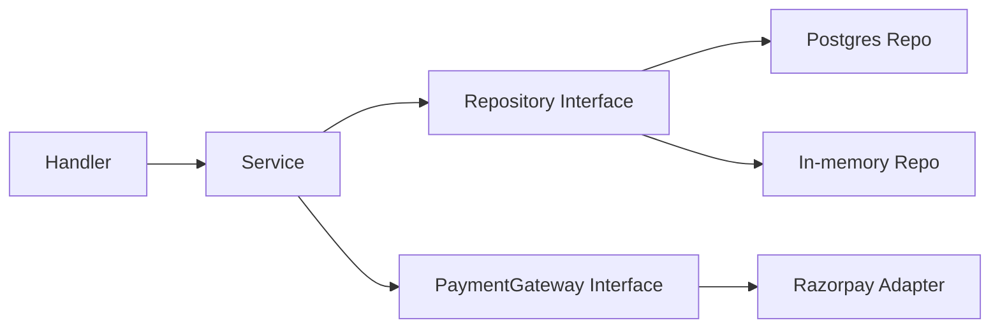

# SOLID Principles in Go LLD

## Complete notes

SOLID is a set of object-oriented design principles. Go is not class-heavy, but SOLID still helps if translated into Go style.

## The five principles

| Principle | Meaning | Go translation |
|---|---|---|
| S - Single Responsibility | one unit should have one reason to change | handler parses HTTP, service owns business logic, repo owns storage |
| O - Open/Closed | open for extension, closed for modification | add new strategy implementation without editing service |
| L - Liskov Substitution | implementation should be replaceable through interface | any `PaymentGateway` should behave like a gateway |
| I - Interface Segregation | small focused interfaces | `Reader`, `Writer`, `Notifier`, not giant service interface |
| D - Dependency Inversion | depend on abstractions, not details | service depends on repository interface, not SQL directly |

## Diagram



## S - Single Responsibility

Bad:

```go
func CreateOrderHandler(w http.ResponseWriter, r *http.Request) {
    // parse request
    // validate cart
    // reserve inventory
    // insert SQL
    // call payment provider
    // send notification
}
```

Better:

```text
Handler -> Service -> Repository / Gateway / EventPublisher
```

Each layer has one reason to change.

## O - Open/Closed

Use Strategy to add new behavior without editing core service.

```go
type PricingStrategy interface {
    Calculate(amount int64) int64
}
```

Add `FestivalPricing`, `SurgePricing`, or `CouponPricing` without rewriting checkout.

## L - Liskov Substitution

If `RazorpayGateway` and `MockGateway` both implement `PaymentGateway`, the service should work with either.

Bad implementation violates expectation:

```text
MockGateway returns success but does not validate amount. Tests may lie.
```

## I - Interface Segregation

Bad:

```go
type UserRepository interface {
    CreateUser()
    DeleteUser()
    CreateOrder()
    RefundPayment()
    SendEmail()
}
```

Better:

```go
type OrderRepository interface { SaveOrder() }
type Notifier interface { Send() }
```

## D - Dependency Inversion

High-level business logic should not depend directly on low-level SQL/payment SDK details.

```go
type OrderService struct {
    orders OrderRepository
    pay    PaymentGateway
}
```

## SOLID in Zepto-style LLD

For inventory/order assignment:

- SRP: Checkout service coordinates, inventory repo reserves stock, strategy chooses store.
- OCP: Add new store selection strategy without editing checkout.
- LSP: Any strategy should return a valid store or error.
- ISP: Keep inventory/order/payment interfaces small.
- DIP: Checkout depends on interfaces, not concrete DB/SDK code.

## Interview answer

I apply SOLID in Go using small structs, small interfaces, constructor injection, and composition. I avoid inheritance-style design and keep the domain service dependent on abstractions where change or testing matters.

## Common mistakes

- quoting SOLID definitions without code
- using large interfaces
- adding abstraction everywhere
- using inheritance examples in Go
- ignoring error behavior in interface contracts

## Quick revision

SOLID in Go means small responsibilities, small interfaces, composition, and dependency injection.
