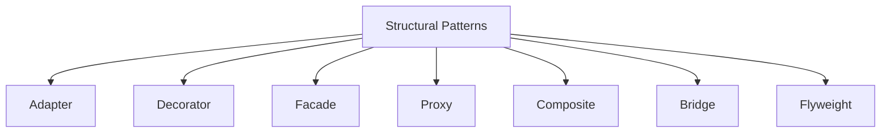
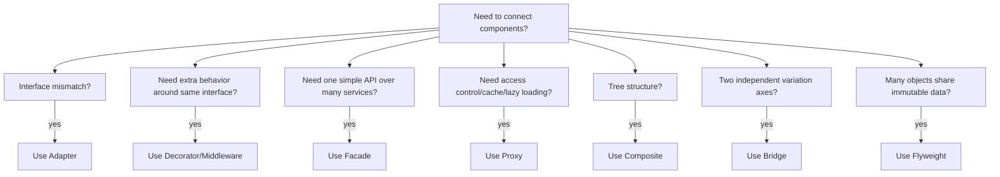

# Structural Patterns in Go

## Complete notes

Structural patterns are about assembling objects and interfaces into larger structures.

They answer this question:

```text
How should components fit together without tight coupling?
```

## Why this matters

Backend systems are mostly composition:

```text
HTTP handler -> service -> repository -> database
service -> cache
service -> external API adapter
service -> middleware/decorator
```

Structural patterns help you connect these components without making every part know too much about every other part.

## Subtopics

| Pattern | Core purpose | Real-world analogy | Go note |
|---|---|---|---|
| Adapter | Makes incompatible interfaces work together | travel plug adapter | [[Adapter Pattern in Go]] |
| Decorator | Adds behavior without changing original code | adding jacket over clothes | [[Decorator Middleware Pattern in Go]] |
| Facade | Provides simple API over complex subsystem | Place Order hides billing/shipping/inventory | [[Facade Pattern in Go]] |
| Proxy | Controls access to another object | credit card as proxy for bank cash | [[Proxy Pattern in Go]] |
| Composite | Treats individual and grouped objects uniformly | folders contain files and folders | [[Composite Pattern in Go]] |
| Bridge | Separates abstraction from implementation | remote control separated from TV model | [[Bridge Pattern in Go]] |
| Flyweight | Shares common data to save memory | many trees share same texture | [[Flyweight Pattern in Go]] |

## Diagram



## Backend examples

| Pattern | Backend example |
|---|---|
| Adapter | wrap Razorpay/Stripe SDK behind PaymentGateway |
| Decorator | Gin middleware for auth/logging/rate limiting |
| Facade | CheckoutService coordinates cart, inventory, payment |
| Proxy | cached product service proxy |
| Composite | product category tree |
| Bridge | report type separated from export format |
| Flyweight | shared product metadata for many cart/order items |

## How to choose



## Go implementation style

| Pattern | Idiomatic Go style |
|---|---|
| Adapter | struct wrapping external SDK and implementing local interface |
| Decorator | middleware or wrapper function |
| Facade | service that coordinates smaller services |
| Proxy | wrapper with same interface plus cache/auth/lazy behavior |
| Composite | interface implemented by leaf and group nodes |
| Bridge | struct has implementation interface field |
| Flyweight | shared immutable object cache |

## Zepto-style example

In a Zepto checkout:

- Adapter wraps payment/delivery provider SDK.
- Decorator adds logging/rate limit/tracing around handlers.
- Facade exposes `CheckoutService.PlaceOrder`.
- Proxy caches product/catalog lookups.
- Composite models category/subcategory/product tree.
- Bridge separates report type from export format.
- Flyweight shares product metadata across cart/order items.

## What to say in interview

Structural patterns help manage dependencies and composition. In Go, they usually appear as interfaces, embedded structs, wrappers, middleware, and small composition-based services.

## Senior explanation

Structural patterns are not about inheritance in Go. They are about composing small pieces cleanly. I use them when direct coupling would make a component hard to test, replace, wrap, or understand.

## Common mistakes

- making wrappers that hide errors
- building a facade that becomes a god service
- using complex pattern names for simple composition
- sharing mutable flyweight state
