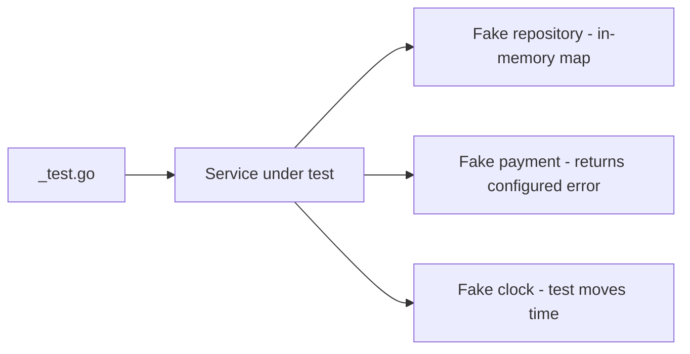

# Testing LLD Code in Go

## Complete notes

In an LLD round, saying how you would test the design is a strong signal. In a take-home or machine-coding round, actually writing tests often decides the result.

Good LLD makes testing easy. If a service takes its dependencies as small interfaces (see [[Error Handling and Interfaces in Go LLD]]), you can test it with simple fakes: no database, no network, no mocking framework.

What to test in an LLD problem:

1. **Happy path** of the core method.
2. **Business rule failures**: out of stock, invalid transition, limit exceeded.
3. **Concurrency**: N goroutines hit the same resource and exactly one (or K) wins.
4. **Failure + compensation**: payment fails, so stock must be released.
5. **Time-based rules** (TTL, fines, rate limits) with an injectable clock.

## Diagram



## Code under test

```go
package checkout

import (
    "context"
    "errors"
    "sync"
)

var ErrOutOfStock = errors.New("out of stock")

type Inventory interface {
    Reserve(ctx context.Context, productID string, qty int) error
    Release(ctx context.Context, productID string, qty int) error
}

type Payment interface {
    Charge(ctx context.Context, userID string, amount int64) error
}

type Service struct {
    inv Inventory
    pay Payment
}

func NewService(inv Inventory, pay Payment) *Service {
    return &Service{inv: inv, pay: pay}
}

func (s *Service) Checkout(ctx context.Context, userID, productID string, qty int, amount int64) error {
    if err := s.inv.Reserve(ctx, productID, qty); err != nil {
        return err
    }
    if err := s.pay.Charge(ctx, userID, amount); err != nil {
        _ = s.inv.Release(ctx, productID, qty) // compensate
        return err
    }
    return nil
}

// FakeInventory is a thread-safe in-memory implementation used by tests.
// It is small enough to keep in a _test.go file.
type FakeInventory struct {
    mu    sync.Mutex
    Stock map[string]int
}

func (f *FakeInventory) Reserve(ctx context.Context, productID string, qty int) error {
    f.mu.Lock()
    defer f.mu.Unlock()
    if f.Stock[productID] < qty {
        return ErrOutOfStock
    }
    f.Stock[productID] -= qty
    return nil
}

func (f *FakeInventory) Release(ctx context.Context, productID string, qty int) error {
    f.mu.Lock()
    defer f.mu.Unlock()
    f.Stock[productID] += qty
    return nil
}

type FakePayment struct{ Err error }

func (f FakePayment) Charge(ctx context.Context, userID string, amount int64) error { return f.Err }
```

## 1. Table-driven test

The standard Go style: one test function, a slice of cases, `t.Run` per case.

```go
package checkout

import (
    "context"
    "errors"
    "testing"
)

func TestCheckout(t *testing.T) {
    errDeclined := errors.New("card declined")

    tests := []struct {
        name      string
        stock     int
        qty       int
        payErr    error
        wantErr   error
        wantStock int
    }{
        {name: "success", stock: 5, qty: 2, wantStock: 3},
        {name: "out of stock", stock: 1, qty: 2, wantErr: ErrOutOfStock, wantStock: 1},
        {name: "payment fails releases stock", stock: 5, qty: 2, payErr: errDeclined, wantErr: errDeclined, wantStock: 5},
    }

    for _, tc := range tests {
        t.Run(tc.name, func(t *testing.T) {
            inv := &FakeInventory{Stock: map[string]int{"milk": tc.stock}}
            svc := NewService(inv, FakePayment{Err: tc.payErr})

            err := svc.Checkout(context.Background(), "u1", "milk", tc.qty, 100)

            if !errors.Is(err, tc.wantErr) {
                t.Fatalf("err = %v, want %v", err, tc.wantErr)
            }
            if got := inv.Stock["milk"]; got != tc.wantStock {
                t.Fatalf("stock = %d, want %d", got, tc.wantStock)
            }
        })
    }
}
```

## 2. Concurrency test (run with -race)

Prove that the last unit cannot be sold twice.

```go
package checkout

import (
    "context"
    "sync"
    "sync/atomic"
    "testing"
)

func TestCheckout_LastItemOnlyOneWinner(t *testing.T) {
    inv := &FakeInventory{Stock: map[string]int{"milk": 1}}
    svc := NewService(inv, FakePayment{})

    var wins atomic.Int32
    var wg sync.WaitGroup
    for i := 0; i < 50; i++ {
        wg.Add(1)
        go func() {
            defer wg.Done()
            if svc.Checkout(context.Background(), "u", "milk", 1, 100) == nil {
                wins.Add(1)
            }
        }()
    }
    wg.Wait()

    if wins.Load() != 1 {
        t.Fatalf("winners = %d, want 1", wins.Load())
    }
    if inv.Stock["milk"] != 0 {
        t.Fatalf("stock = %d, want 0", inv.Stock["milk"])
    }
}
```

```bash
go test -race ./...
```

Without the mutex in `FakeInventory`, `-race` reports a `DATA RACE` and the test usually shows more than one winner.

## 3. Injectable clock for time rules

Never call `time.Now()` directly inside TTL, fine, or rate-limit logic. Inject it.

```go
package clock

import "time"

type Clock interface{ Now() time.Time }

type Real struct{}

func (Real) Now() time.Time { return time.Now() }

// Fake lets tests jump time without sleeping.
type Fake struct{ T time.Time }

func (f *Fake) Now() time.Time          { return f.T }
func (f *Fake) Advance(d time.Duration) { f.T = f.T.Add(d) }
```

A test for seat-lock expiry: lock a seat, call `clock.Advance(11 * time.Minute)`, and assert the seat is available again. No `time.Sleep`, no flaky tests.

## Fakes vs mocks

| | Fake | Mock (gomock/testify) |
|---|---|---|
| What | real small implementation (map-based repo) | records calls, asserts expectations |
| Good for | state-based tests, most LLD | checking "was X called with Y" |
| Risk | slightly more code | brittle tests tied to call order |

For LLD, prefer fakes. Use a mock only when the interaction itself is the behavior (e.g. "notification sent exactly once").

## Interview answer

```text
Because services depend on small interfaces, I can test them with in-memory fakes. I would write table-driven tests for the core method covering success, business-rule failures, and compensation on payment failure. For race conditions I would start 50 goroutines on the last unit, assert exactly one winner, and run with -race. Time-based rules use an injected clock so tests do not sleep.
```

## Common mistakes

- calling `time.Now()` / `rand` directly, which makes tests flaky
- testing through HTTP when a service-level test is enough
- mocks that assert every internal call (tests break on any refactor)
- no concurrency test for the exact race the interviewer asked about
- forgetting `-race`
- fakes that are not thread-safe themselves

## Quick revision

```text
table tests -> t.Run per case
fakes over mocks
concurrency -> N goroutines + WaitGroup + atomic winners + -race
time -> inject Clock
```

## Sources

- Go testing tutorial: https://go.dev/doc/tutorial/add-a-test
- Table-driven tests: https://go.dev/wiki/TableDrivenTests
- Race detector: https://go.dev/doc/articles/race_detector
