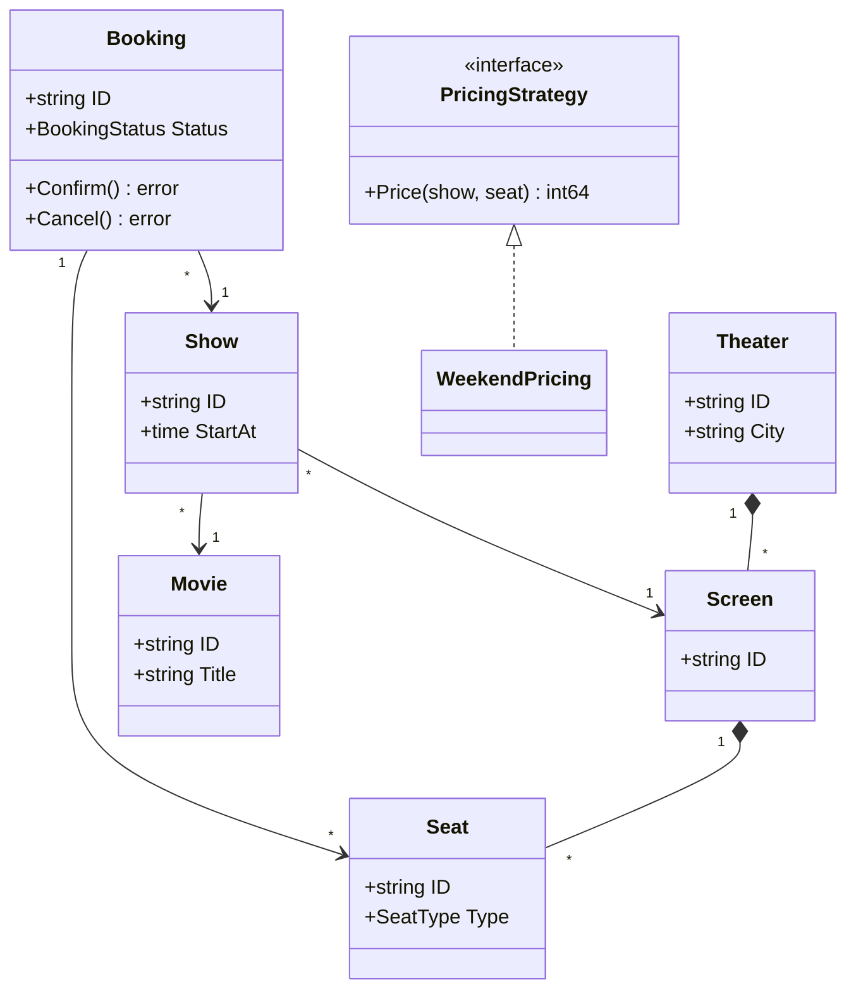
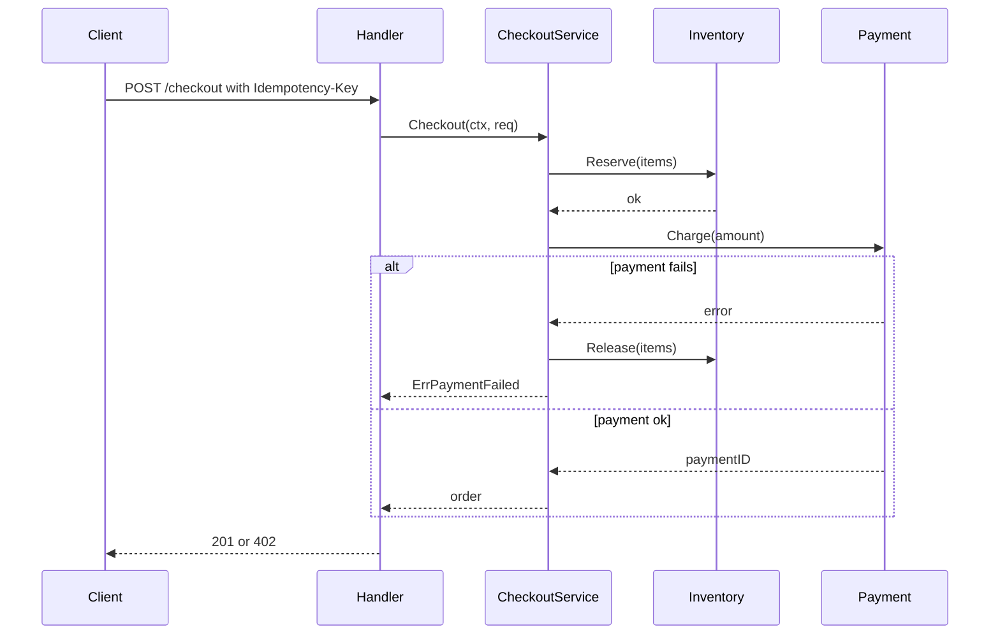
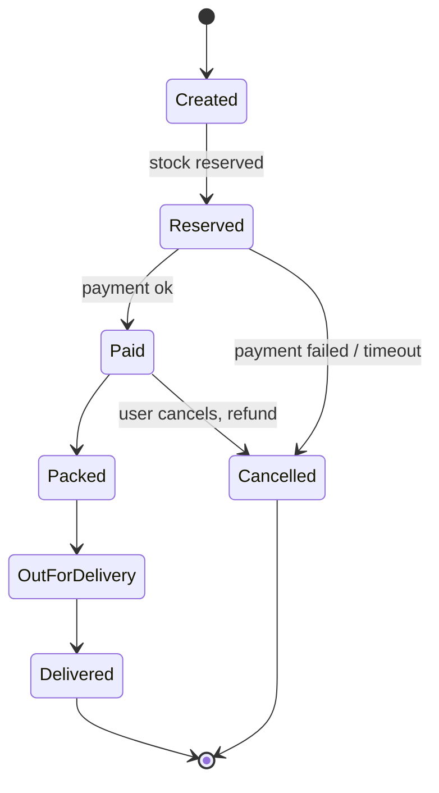

# UML for LLD Interviews

## Complete notes

Interviewers do not want full formal UML. They want a quick picture that shows:

- the main entities and what they hold
- how entities relate (has-a, owns, uses, implements)
- how the core flow moves between components
- how an object's status changes

Three diagrams cover almost every LLD round:

| Diagram | Answers | Draw when |
|---|---|---|
| Class diagram | what exists and how it connects | always, after requirements |
| Sequence diagram | who calls whom, in what order | for the core flow (checkout, booking) |
| State diagram | which status changes are legal | anything with a lifecycle (order, seat, ride) |

Activity and use-case diagrams are rarely needed. A bullet list of use cases is enough.

## Relationships

| Relationship | Meaning | Mermaid | Go form |
|---|---|---|---|
| Association | uses / knows about | `A --> B` | field holding an ID or pointer |
| Aggregation | has, but parts live independently | `A o-- B` | `[]*B` or `[]string` IDs; B created elsewhere |
| Composition | owns, parts die with whole | `A *-- B` | `[]B` value slice created by A |
| Inheritance | is-a | `A <\|-- B` | **not in Go**: use embedding or an interface |
| Realization | implements interface | `I <\|.. C` | implicit: C has I's methods |
| Dependency | temporarily uses | `A ..> B` | B is a method parameter |

Multiplicity: `"1" -- "*"` means one-to-many.

Examples:

- Theater **aggregates** Screens? Usually **composition**: a screen does not exist without its theater.
- Show **associates** with Movie: the movie exists without the show.
- Order **composes** OrderItems: items die with the order.
- `NearestStoreStrategy` **realizes** `StoreSelectionStrategy`.

## Class diagram example: movie booking



In Go this becomes structs with ID fields, a `PricingStrategy` interface, and services that operate on them. See [[Movie Ticket Booking LLD in Go]].

## Sequence diagram example: checkout



Use `alt` blocks to show the failure path. Interviewers like seeing compensation drawn explicitly.

## State diagram example: order



This maps directly to the transition table in [[State Pattern in Go]].

## Java UML to Go

| UML idea | Go |
|---|---|
| abstract class `Vehicle` with subclasses | `Vehicle` interface, or one struct with a `Type` field if behavior is the same |
| `protected` fields | unexported fields in the same package |
| `+ public` / `- private` | Exported (Capital) / unexported (lowercase) |
| static method | package-level function |
| enum | typed constant: `type SpotType int` + `iota` |

Tip: if subclasses differ only in data (a car spot vs a bike spot), do not draw inheritance. Draw one `Spot` with a `Type` field. That is [[KISS Principle in Go LLD]].

## Whiteboard order (5 minutes)

1. Boxes for 5-8 core entities, only key fields.
2. Lines with multiplicity.
3. One `<<interface>>` box per variation point (strategy, provider, repository).
4. A sequence diagram for the single hardest flow.
5. A state diagram if any entity has a status field.

## Interview answer

```text
I will draw a class diagram with the core entities and their relationships, mark interfaces where behavior varies, then a sequence diagram for the main flow including the failure path, and a state diagram for any entity with a lifecycle. In Go, inheritance becomes interfaces or composition, and enums become typed constants.
```

## Common mistakes

- drawing every getter, setter, and field
- deep inheritance trees copied from Java
- no multiplicity on relationships
- sequence diagram with only the happy path
- a status field with no state diagram, so illegal transitions are never discussed
- spending 20 minutes on diagrams and never writing code

## Sources

- Mermaid class diagrams: https://mermaid.js.org/syntax/classDiagram.html
- Mermaid sequence diagrams: https://mermaid.js.org/syntax/sequenceDiagram.html
- Mermaid state diagrams: https://mermaid.js.org/syntax/stateDiagram.html
