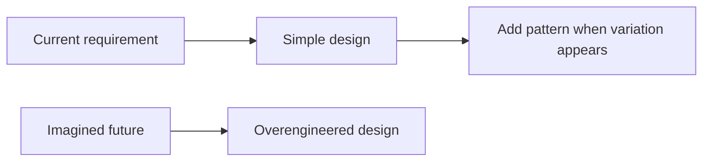

# YAGNI Principle in Go LLD

## Complete notes

YAGNI means You Aren't Gonna Need It.

It means do not build features, abstractions, interfaces, or patterns before there is a real need.

In LLD interviews, YAGNI helps you avoid overengineering.

## Simple example

Bad for first version:

```text
PaymentService
PaymentStrategy
PaymentFactory
PaymentAbstractFactory
PaymentPluginRegistry
PaymentEventEngine
```

If only one payment provider exists, start simple:

```go
type PaymentGateway interface {
    Charge(ctx context.Context, amount int64) error
}
```

Add Factory/Strategy only when multiple providers or algorithms appear.

## Diagram



## YAGNI in Go

Go rewards simple code. Before adding an interface, ask:

- Do I have more than one implementation?
- Do I need to mock this in tests?
- Is this boundary external or unstable?
- Does the abstraction make the caller simpler?

If all answers are no, use concrete code.

## YAGNI and design patterns

Patterns are tools, not checklist items. Do not force all patterns into one design.

Use patterns when they solve a real problem:

| Real problem | Useful pattern |
|---|---|
| multiple pricing algorithms | Strategy |
| many providers by config | Factory |
| external API mismatch | Adapter |
| order lifecycle rules | State |
| many subscribers to event | Observer |

## Interview answer

I would start with the simplest design that satisfies current requirements, but keep boundaries clear so future change is possible. I avoid adding abstractions until there is real variation or testability need.

## Common mistakes

- adding every pattern to impress interviewer
- creating interfaces for every struct
- designing for imaginary scale before basic correctness
- building generic frameworks instead of solving the problem

## Quick revision

YAGNI says: build for current requirements, leave clean extension points, avoid imaginary complexity.
