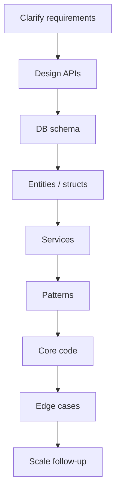

# Zepto SDE1 LLD Round Pattern

## Complete notes

For Zepto SDE-1 backend, the LLD round commonly mixes:

- low-level class/entity design
- DB schema
- API design
- core method implementation
- backend edge cases
- concurrency/race condition discussion

Do not prepare only Parking Lot. Zepto-style problems often look like real product domains: inventory, order assignment, dark stores, delivery partners, social/feed, bookstore/library, cart/checkout.

## Diagram

## Expected flow



## What to say first

```text
I will first clarify the core use cases, then design APIs and DB tables, then model the Go structs and services, and finally implement the core flow with edge cases.
```

## Common Zepto-like questions

| Problem | What it tests |
|---|---|
| Inventory and order assignment | stock reservation, race conditions, dark store selection |
| Online bookstore/library | borrow/return, availability, schema, service methods |
| Cart checkout | pricing, coupon, stock validation, payment failure |
| Delivery partner assignment | strategy, location, availability, state |
| Social media schema | users, followers, posts, comments, tags, top K |
| Notification system | observer/strategy/factory |
| Rate limiter | algorithm design + code |
| Booking system | overlap checks, locks, state |

## Time management

| Time | Action |
|---|---|
| 0-5 min | clarify requirements and scope |
| 5-15 min | APIs + DB schema |
| 15-25 min | structs/interfaces/services |
| 25-50 min | core implementation |
| 50-60 min | edge cases and follow-ups |

## API example

```text
POST /orders
GET /orders/{id}
POST /orders/{id}/cancel
POST /inventory/reserve
POST /delivery/assign
```

## Go code shape

```go
type OrderService struct {
    inventory InventoryRepository
    orders    OrderRepository
    selector  StoreSelectionStrategy
}

func (s *OrderService) PlaceOrder(ctx context.Context, userID string, items []OrderItem) (Order, error) {
    stores, err := s.inventory.FindCandidateStores(ctx, items)
    if err != nil {
        return Order{}, err
    }

    store, err := s.selector.SelectStore(ctx, stores, items)
    if err != nil {
        return Order{}, err
    }

    if err := s.inventory.Reserve(ctx, store.ID, items); err != nil {
        return Order{}, err
    }

    order := Order{UserID: userID, StoreID: store.ID, Items: items, Status: "reserved"}
    return order, s.orders.Save(ctx, order)
}
```

## Real-life example

A Zepto user orders milk, bread, and chips. The backend must pick a dark store that has all items, reserve inventory, create the order, and later assign a rider. The LLD round checks whether you can model this flow without overselling stock or mixing all logic into one class/function.

## When to use this pattern

Use this answer structure whenever the interviewer asks a backend product LLD question: bookstore, inventory, cart, social media, notification, booking, or delivery assignment.

## DB schema example

```sql
users(id, name, phone, created_at)
stores(id, name, lat, lng, active)
products(id, sku, name)
inventory(id, store_id, product_id, available_qty, reserved_qty, updated_at)
orders(id, user_id, store_id, status, total_amount, created_at)
order_items(id, order_id, product_id, qty, price)
delivery_partners(id, name, status, current_lat, current_lng)
```

## Edge cases they will like

- two users ordering the last item at the same time
- payment succeeds but stock reservation fails
- delivery partner becomes unavailable
- cancellation after inventory reservation
- duplicate API retry creates duplicate order
- stale inventory cache
- dark store has partial stock only

## Strong answer pattern

```text
For stock reservation, I would make inventory update atomic. In SQL, I can update only if available_qty >= requested_qty. If rows affected is zero, reservation fails. This prevents overselling even under concurrent orders.
```

## Go implementation direction

Use:

- Repository for storage
- Strategy for store/partner assignment
- State for order lifecycle
- Observer for notifications
- Facade for checkout flow

## Interview trap

Do not jump directly to code. Zepto questions often evaluate whether you can think like a backend engineer: schema, API, race conditions, failure paths, and clean code.
