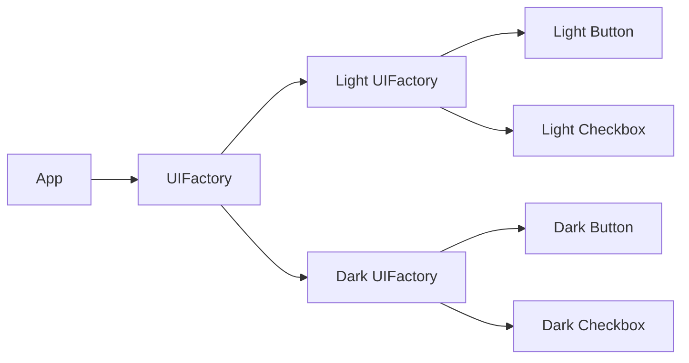

# Abstract Factory Pattern in Go

## Complete notes

Abstract Factory creates families of related objects without the caller knowing concrete types.

Factory creates one object. Abstract Factory creates a group of related objects that should work together.

## Diagram



## Go code

```go
package ui

import "fmt"

type Button interface { Render() string }
type Checkbox interface { Render() string }

type UIFactory interface {
    CreateButton() Button
    CreateCheckbox() Checkbox
}

type LightButton struct{}
func (LightButton) Render() string { return "light button" }

type LightCheckbox struct{}
func (LightCheckbox) Render() string { return "light checkbox" }

type DarkButton struct{}
func (DarkButton) Render() string { return "dark button" }

type DarkCheckbox struct{}
func (DarkCheckbox) Render() string { return "dark checkbox" }

type LightFactory struct{}
func (LightFactory) CreateButton() Button { return LightButton{} }
func (LightFactory) CreateCheckbox() Checkbox { return LightCheckbox{} }

type DarkFactory struct{}
func (DarkFactory) CreateButton() Button { return DarkButton{} }
func (DarkFactory) CreateCheckbox() Checkbox { return DarkCheckbox{} }

func NewUIFactory(theme string) (UIFactory, error) {
    switch theme {
    case "light":
        return LightFactory{}, nil
    case "dark":
        return DarkFactory{}, nil
    default:
        return nil, fmt.Errorf("unknown theme: %s", theme)
    }
}
```

## Real-life example

In backend, use Abstract Factory when you need a whole provider family: `PaymentGateway`, `RefundGateway`, and `WebhookVerifier` for Razorpay should be created together and not mixed with Stripe versions.

## When to use

- payment provider family
- cloud provider family
- UI component family
- database driver family
- notification provider family

## When not to use

If you only create one object, normal Factory is enough.

## Interview answer

I would use Abstract Factory when related implementations must be consistent. For example, Razorpay payment, refund, and webhook verifier should come from the same provider factory.

## Common mistakes

- using it when simple factory is enough
- mixing products from different families
- factory contains business workflow logic
