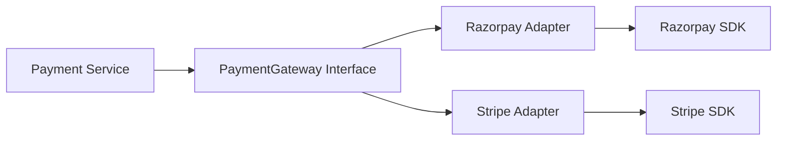

# Adapter Pattern in Go

## Complete notes

Adapter converts an external or incompatible interface into the interface your application expects.

## Diagram



## Go code

```go
package payment

import "context"

type ChargeRequest struct {
    UserID string
    Amount int64
}

type PaymentGateway interface {
    Charge(ctx context.Context, req ChargeRequest) (string, error)
}

type RazorpayClient struct{}
func (c *RazorpayClient) CreatePayment(amount int64, userRef string) (string, error) { return "rzp_123", nil }

type RazorpayAdapter struct {
    client *RazorpayClient
}

func NewRazorpayAdapter(client *RazorpayClient) *RazorpayAdapter {
    return &RazorpayAdapter{client: client}
}

func (a *RazorpayAdapter) Charge(ctx context.Context, req ChargeRequest) (string, error) {
    return a.client.CreatePayment(req.Amount, req.UserID)
}
```

## Real-life example

Razorpay, Stripe, internal wallet, and COD can all have different SDK methods. Your service should call your own `PaymentGateway`, not external SDKs directly.

## When to use

- payment provider integration
- SMS/email provider integration
- cloud storage SDK wrapper
- legacy service wrapper
- third-party delivery API

## When not to use

If your application already owns both interfaces, simplify the interface instead of adding an adapter.

## Interview answer

I would wrap external payment SDKs with adapters so my business service depends on `PaymentGateway`, not provider-specific SDK details.

## Common mistakes

- leaking provider-specific fields everywhere
- adapter contains business rules
- no timeout/context handling
- no provider error normalization
