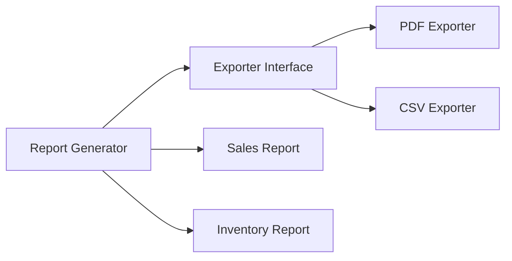

# Bridge Pattern in Go

## Complete notes

Bridge separates abstraction from implementation so both can vary independently.

In Go, this is usually an interface field inside a struct.

## Diagram



## Go code

```go
package report

type Exporter interface {
    Export(title string, rows []string) ([]byte, error)
}

type Report struct {
    title    string
    rows     []string
    exporter Exporter
}

func NewReport(title string, rows []string, exporter Exporter) Report {
    return Report{title: title, rows: rows, exporter: exporter}
}

func (r Report) Generate() ([]byte, error) {
    return r.exporter.Export(r.title, r.rows)
}

type CSVExporter struct{}
func (CSVExporter) Export(title string, rows []string) ([]byte, error) { return []byte(title), nil }

type PDFExporter struct{}
func (PDFExporter) Export(title string, rows []string) ([]byte, error) { return []byte(title), nil }
```

## Real-life example

InvoiceOps can generate invoice reports, payment reports, and tax reports. Each can export as CSV/PDF. Bridge prevents creating combinations like `InvoicePDFReport`, `InvoiceCSVReport`, `PaymentPDFReport`, etc.

## When to use

- two dimensions vary independently
- report type and export format
- notification content and delivery channel
- device abstraction and implementation

## When not to use

If there is only one variation axis, Strategy or simple interface may be enough.

## Interview answer

I would use Bridge when I want to avoid class/type explosion caused by multiple independent variations.

## Common mistakes

- using Bridge when Strategy is enough
- unclear separation between abstraction and implementation
- overengineering small domains
