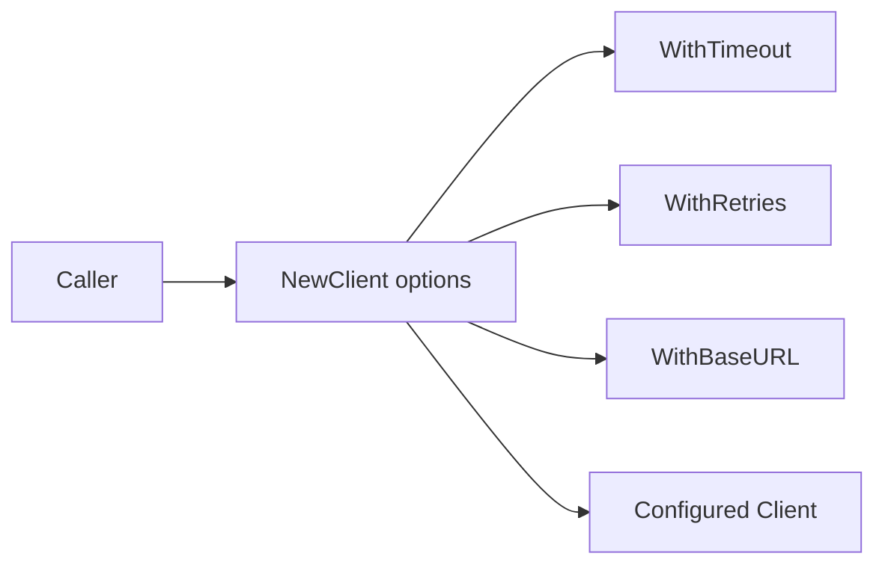

# Builder and Functional Options Pattern in Go

## Complete notes

Builder constructs complex objects step by step. In Go, the idiomatic version is often the Functional Options pattern.

## Diagram



## Go code

```go
package client

import "time"

type APIClient struct {
    baseURL string
    timeout time.Duration
    retries int
}

type Option func(*APIClient)

func WithBaseURL(baseURL string) Option {
    return func(c *APIClient) { c.baseURL = baseURL }
}

func WithTimeout(timeout time.Duration) Option {
    return func(c *APIClient) { c.timeout = timeout }
}

func WithRetries(retries int) Option {
    return func(c *APIClient) { c.retries = retries }
}

func NewAPIClient(options ...Option) *APIClient {
    c := &APIClient{
        baseURL: "https://api.example.com",
        timeout: 3 * time.Second,
        retries: 2,
    }
    for _, option := range options {
        option(c)
    }
    return c
}
```

## How main calls it

```go
func main() {
    client := NewAPIClient(
        WithBaseURL("https://api.invoiceops.local"),
        WithTimeout(5*time.Second),
        WithRetries(3),
    )

    fmt.Println(client.baseURL)
    fmt.Println(client.timeout)
    fmt.Println(client.retries)
}
```

## Example output

```text
https://api.invoiceops.local
5s
3
```

## Real-life example

A payment client may need base URL, API key, timeout, retry count, logger, and metrics. Functional options keep construction readable without many constructors.

## When to use

- API clients
- complex config
- test setup
- optional dependencies
- library packages

## When not to use

For simple structs with two fields, normal construction is clearer.

## Interview answer

In Go, I prefer functional options for complex object construction because it keeps defaults centralized and makes optional configuration readable.

## Common mistakes

- too many options for simple objects
- options that can create invalid config
- no validation after applying options
