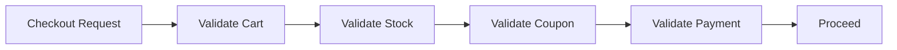

# Chain of Responsibility Pattern in Go

## Complete notes

Chain of Responsibility passes a request through multiple handlers/validators. Each step can accept, reject, or pass forward.

## Diagram



## Go code

```go
package validation

import (
    "context"
    "errors"
)

type CheckoutRequest struct {
    UserID    string
    ProductID string
    Quantity  int
    Coupon    string
}

type Validator interface {
    Validate(ctx context.Context, req CheckoutRequest) error
}

type Chain struct {
    validators []Validator
}

func NewChain(validators ...Validator) Chain {
    return Chain{validators: validators}
}

func (c Chain) Validate(ctx context.Context, req CheckoutRequest) error {
    for _, validator := range c.validators {
        if err := validator.Validate(ctx, req); err != nil {
            return err
        }
    }
    return nil
}

type QuantityValidator struct{}
func (QuantityValidator) Validate(ctx context.Context, req CheckoutRequest) error {
    if req.Quantity <= 0 {
        return errors.New("quantity must be positive")
    }
    return nil
}
```

## How main calls it

```go
func main() {
    chain := NewChain(QuantityValidator{})

    err := chain.Validate(context.Background(), CheckoutRequest{
        UserID: "user_1", ProductID: "milk", Quantity: 2,
    })
    fmt.Println(err)

    err = chain.Validate(context.Background(), CheckoutRequest{Quantity: 0})
    fmt.Println(err)
}
```

## Example output

```text
<nil>
quantity must be positive
```

## Real-life example

Checkout validation has many independent checks: user exists, cart is valid, stock exists, coupon is valid, payment method is allowed. Chain keeps each check separate.

## When to use

- validation pipeline
- approval workflow
- support ticket routing
- fraud checks
- middleware chain

## When not to use

If there are only one or two checks, simple code is clearer.

## Interview answer

I would use a validation chain so each rule is isolated. Adding a new rule, like max order quantity, only adds one validator.

## Common mistakes

- validators mutate request unexpectedly
- unclear validator order
- no structured error type
- chain used when simple condition is enough
