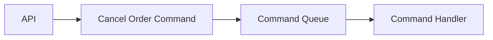

# Command Pattern in Go

## Complete notes

Command turns a request into an object/function that can be queued, retried, logged, or executed later.

## Diagram



## Go code

```go
package command

import "context"

type Command interface {
    Execute(ctx context.Context) error
}

type CancelOrderService interface {
    Cancel(ctx context.Context, orderID string) error
}

type CancelOrderCommand struct {
    orderID string
    service CancelOrderService
}

func NewCancelOrderCommand(orderID string, service CancelOrderService) CancelOrderCommand {
    return CancelOrderCommand{orderID: orderID, service: service}
}

func (c CancelOrderCommand) Execute(ctx context.Context) error {
    return c.service.Cancel(ctx, c.orderID)
}
```

## How main calls it

```go
type OrderCanceller struct{}
func (OrderCanceller) Cancel(ctx context.Context, orderID string) error {
    fmt.Println("cancelled order:", orderID)
    return nil
}

func main() {
    cmd := NewCancelOrderCommand("order_1", OrderCanceller{})
    _ = cmd.Execute(context.Background())
}
```

## Example output

```text
cancelled order: order_1
```

## Real-life example

Admin actions, order cancellation, retryable jobs, and scheduled tasks can be represented as commands. A worker can execute them later.

## When to use

- job queues
- undo/redo
- scheduled tasks
- command-based CLI
- audit-friendly admin actions

## When not to use

For a simple direct function call, command may add unnecessary ceremony.

## Interview answer

I would use Command when actions need to be queued, retried, logged, or executed later. The worker only needs to call `Execute`.

## Common mistakes

- command stores too much mutable state
- no idempotency for retried commands
- no clear failure handling
