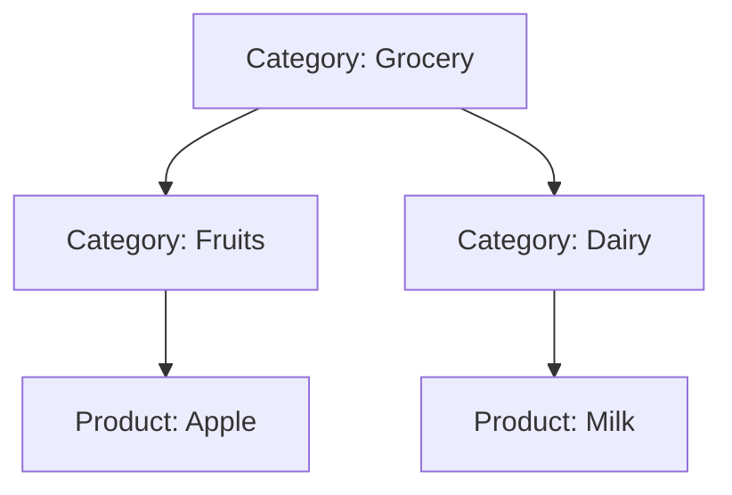

# Composite Pattern in Go

## Complete notes

Composite lets individual objects and groups of objects be treated uniformly.

It is useful for tree structures.

## Diagram



## Go code

```go
package catalog

type CatalogNode interface {
    Name() string
    CountProducts() int
}

type Product struct { name string }
func (p Product) Name() string { return p.name }
func (p Product) CountProducts() int { return 1 }

type Category struct {
    name     string
    children []CatalogNode
}

func (c *Category) Name() string { return c.name }
func (c *Category) Add(child CatalogNode) { c.children = append(c.children, child) }
func (c *Category) CountProducts() int {
    total := 0
    for _, child := range c.children {
        total += child.CountProducts()
    }
    return total
}
```

## How main calls it

```go
func main() {
    grocery := &Category{name: "Grocery"}
    dairy := &Category{name: "Dairy"}

    dairy.Add(Product{name: "Milk"})
    dairy.Add(Product{name: "Curd"})
    grocery.Add(dairy)
    grocery.Add(Product{name: "Bread"})

    fmt.Println(grocery.Name())
    fmt.Println(grocery.CountProducts())
}
```

## Example output

```text
Grocery
3
```

## Real-life example

Zepto catalog has categories and subcategories. A category can contain products and more categories. Composite lets you calculate counts or traverse uniformly.

## When to use

- category tree
- file system
- organization hierarchy
- menu/submenu
- comments with replies

## When not to use

Do not use Composite for flat lists; it adds unnecessary abstraction.

## Interview answer

I would use Composite when the domain is naturally a tree and the caller should treat leaf and group nodes uniformly.

## Common mistakes

- forcing tree model onto non-tree data
- no cycle prevention
- recursive traversal without depth limits
