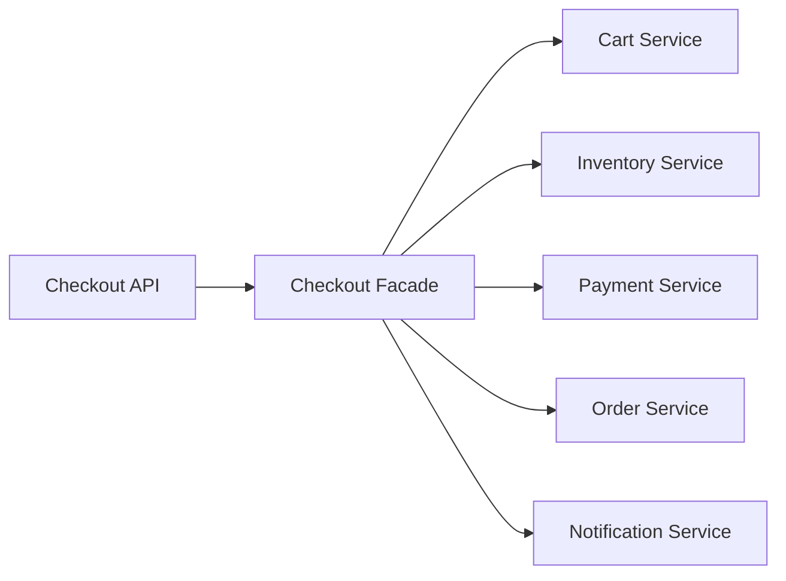

# Facade Pattern in Go

## Complete notes

Facade provides a simple high-level method over multiple lower-level services.

In backend LLD, a service method like `Checkout` is often a facade over cart, inventory, payment, order, and notification.

## Diagram



## Go code

```go
package checkout

import "context"

type InventoryService interface {
    Reserve(ctx context.Context, productID string, qty int) error
}

type PaymentService interface {
    Charge(ctx context.Context, userID string, amount int64) error
}

type OrderService interface {
    Create(ctx context.Context, userID string, amount int64) (string, error)
}

type Service struct {
    inventory InventoryService
    payment   PaymentService
    orders    OrderService
}

func NewService(i InventoryService, p PaymentService, o OrderService) *Service {
    return &Service{inventory: i, payment: p, orders: o}
}

func (s *Service) Checkout(ctx context.Context, userID string, productID string, qty int, amount int64) (string, error) {
    if err := s.inventory.Reserve(ctx, productID, qty); err != nil {
        return "", err
    }
    if err := s.payment.Charge(ctx, userID, amount); err != nil {
        return "", err
    }
    return s.orders.Create(ctx, userID, amount)
}
```

## Real-life example

A client clicks Place Order. Behind one API, the backend validates cart, reserves stock, charges payment, creates order, and sends notification. Facade gives the caller one simple entry point.

## When to use

- checkout workflow
- onboarding workflow
- payment workflow
- file upload processing
- report generation

## When not to use

Do not put every business rule into one facade. Keep domain services separate.

## Interview answer

I would expose `CheckoutService.Checkout` as a facade because the API should not coordinate inventory, payment, and order creation directly.

## Common mistakes

- facade becomes a god class
- no compensation when later step fails
- hiding important errors
- mixing HTTP request parsing into facade
