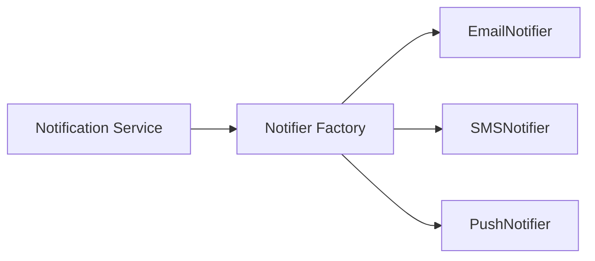

# Factory Pattern in Go

## Complete notes

Factory pattern centralizes object creation when the caller should not know which concrete implementation to build.

In Go, a factory is often just a function.

## Diagram



## Go code

```go
package notification

import (
    "context"
    "errors"
)

type Notifier interface {
    Send(ctx context.Context, to string, message string) error
}

type EmailNotifier struct{}
func (EmailNotifier) Send(ctx context.Context, to string, message string) error { return nil }

type SMSNotifier struct{}
func (SMSNotifier) Send(ctx context.Context, to string, message string) error { return nil }

type PushNotifier struct{}
func (PushNotifier) Send(ctx context.Context, to string, message string) error { return nil }

func NewNotifier(channel string) (Notifier, error) {
    switch channel {
    case "email":
        return EmailNotifier{}, nil
    case "sms":
        return SMSNotifier{}, nil
    case "push":
        return PushNotifier{}, nil
    default:
        return nil, errors.New("unsupported notification channel")
    }
}
```

## Real-life example

For order updates, Zepto can notify users by push, SMS, WhatsApp, or email. The order service should not construct each provider directly. It asks a factory for the notifier.

## When to use

- payment provider creation
- notification channel creation
- parser creation based on file type
- storage client creation based on config
- discount strategy creation from coupon type

## When not to use

Do not create a factory around simple structs where direct construction is clearer.

## Interview answer

I would use a factory when the creation logic depends on type/config and the caller should depend only on an interface. In Go, I can implement this as `NewNotifier(channel)` returning a `Notifier` interface.

## Common mistakes

- returning concrete types instead of interface when caller needs abstraction
- putting business logic inside factory
- using factory for every object unnecessarily
