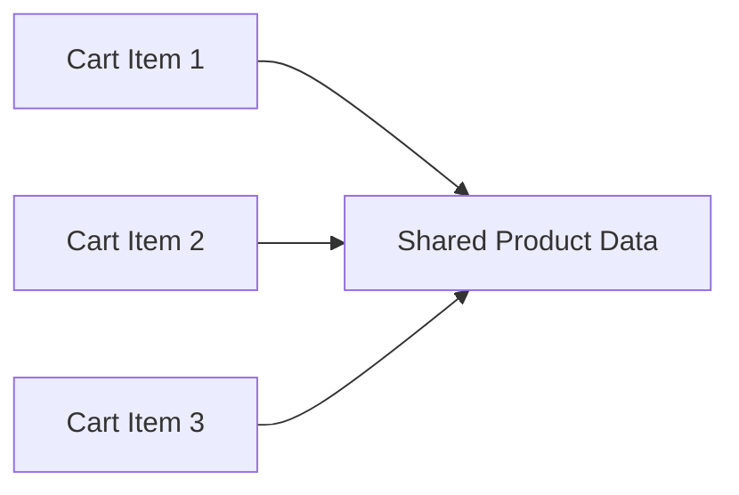

# Flyweight Pattern in Go

## Complete notes

Flyweight shares common immutable data between many objects to save memory.

## Diagram



## Go code

```go
package catalog

type ProductData struct {
    SKU   string
    Name  string
    Brand string
}

type ProductFactory struct {
    cache map[string]*ProductData
}

func NewProductFactory() *ProductFactory {
    return &ProductFactory{cache: make(map[string]*ProductData)}
}

func (f *ProductFactory) Get(sku string, name string, brand string) *ProductData {
    if p, ok := f.cache[sku]; ok {
        return p
    }
    p := &ProductData{SKU: sku, Name: name, Brand: brand}
    f.cache[sku] = p
    return p
}

type CartItem struct {
    Product *ProductData
    Qty     int
}
```

## How main calls it

```go
func main() {
    factory := NewProductFactory()

    milk1 := factory.Get("sku_milk", "Milk", "Amul")
    milk2 := factory.Get("sku_milk", "Milk", "Amul")

    fmt.Println(milk1 == milk2)
}
```

## Example output

```text
true
```

Both cart items share the same product metadata object.

## Real-life example

Thousands of cart/order items can reference the same product metadata instead of duplicating product name, brand, image URL, and category everywhere in memory.

## When to use

- many objects share large immutable state
- game objects
- catalog data
- text rendering/glyphs
- product metadata cache

## When not to use

Do not use Flyweight if memory is not a problem or shared state is mutable.

## Interview answer

I would use Flyweight when many objects share the same immutable data. The unique object keeps only extrinsic state like quantity, while common product metadata is shared.

## Common mistakes

- sharing mutable state accidentally
- making cache unbounded
- adding complexity without memory pressure
