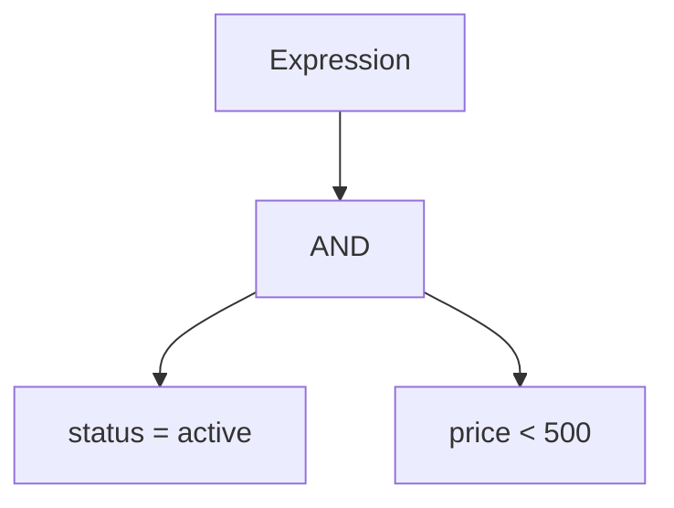

# Interpreter Pattern in Go

## Complete notes

Interpreter evaluates a small language or expression grammar.

In backend LLD, this appears in filters, search predicates, rule engines, and query expressions.

## Diagram



## Go code

```go
package rules

type Product struct {
    Status string
    Price  int64
}

type Expression interface {
    Match(p Product) bool
}

type StatusExpr struct { Status string }
func (e StatusExpr) Match(p Product) bool { return p.Status == e.Status }

type MaxPriceExpr struct { Price int64 }
func (e MaxPriceExpr) Match(p Product) bool { return p.Price <= e.Price }

type AndExpr struct {
    Left  Expression
    Right Expression
}
func (e AndExpr) Match(p Product) bool {
    return e.Left.Match(p) && e.Right.Match(p)
}
```

## How main calls it

```go
func main() {
    rule := AndExpr{
        Left:  StatusExpr{Status: "active"},
        Right: MaxPriceExpr{Price: 500},
    }

    fmt.Println(rule.Match(Product{Status: "active", Price: 399}))
    fmt.Println(rule.Match(Product{Status: "inactive", Price: 399}))
}
```

## Example output

```text
true
false
```

## Real-life example

An admin wants to create product filters like `status = active AND price < 500`. Interpreter can model each condition as an expression tree.

## When to use

- rule engines
- search filters
- boolean predicates
- query builders
- simple DSLs

## When not to use

Do not build your own language if normal code or SQL can solve it safely.

## Interview answer

I would use Interpreter for a small expression language where conditions can be composed dynamically, such as filters with AND/OR rules.

## Common mistakes

- building a complex DSL too early
- no parser/validation boundaries
- security risk if expressions become raw SQL
