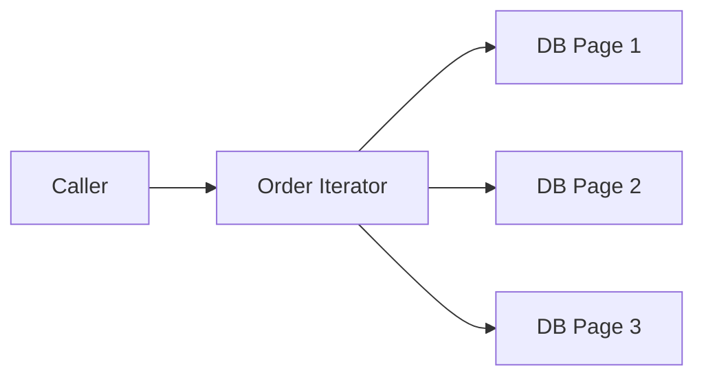

# Iterator Pattern in Go

## Complete notes

Iterator provides sequential access to elements without exposing the underlying collection structure.

In Go, this is often done with channels, callback functions, or simple `Next` methods.

## Diagram



## Go code

```go
package orders

type Order struct { ID string }

type Iterator struct {
    orders []Order
    index  int
}

func NewIterator(orders []Order) *Iterator {
    return &Iterator{orders: orders}
}

func (it *Iterator) HasNext() bool {
    return it.index < len(it.orders)
}

func (it *Iterator) Next() Order {
    order := it.orders[it.index]
    it.index++
    return order
}
```

## Real-life example

A report generator can iterate over paginated orders without knowing whether data comes from memory, DB pages, or a streaming API.

## When to use

- paginated records
- file scanners
- stream processing
- tree traversal
- batch jobs

## When not to use

For normal slices, Go `for range` is simpler.

## Interview answer

I would use Iterator when the caller should process elements one by one without knowing how they are fetched internally.

## Common mistakes

- not handling end of iteration
- loading huge data all at once when pagination is needed
- iterator not safe for concurrent use but shared across goroutines
