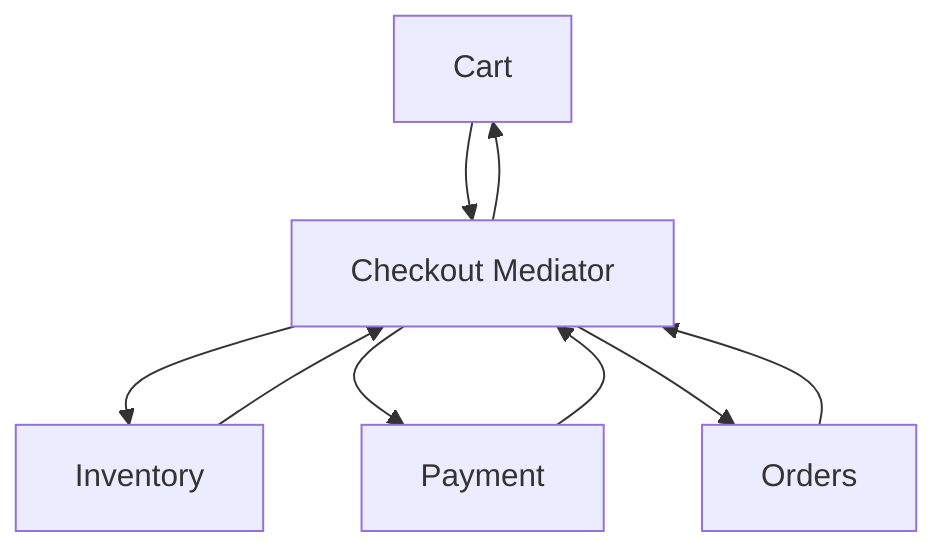

# Mediator Pattern in Go

## Complete notes

Mediator centralizes communication between objects so they do not directly depend on each other.

## Diagram



## Go code

```go
package checkout

import "context"

type CheckoutMediator struct {
    inventory InventoryService
    payment   PaymentService
    orders    OrderService
}

func (m *CheckoutMediator) Checkout(ctx context.Context, req Request) (string, error) {
    if err := m.inventory.Reserve(ctx, req.ProductID, req.Quantity); err != nil {
        return "", err
    }
    if err := m.payment.Charge(ctx, req.UserID, req.Amount); err != nil {
        return "", err
    }
    return m.orders.Create(ctx, req.UserID, req.Amount)
}
```

## How main calls it

```go
func main() {
    mediator := &CheckoutMediator{
        inventory: fakeInventory{},
        payment:   fakePayment{},
        orders:    fakeOrders{},
    }

    orderID, err := mediator.Checkout(context.Background(), Request{
        UserID: "user_1", ProductID: "milk", Quantity: 1, Amount: 6000,
    })
    if err != nil {
        fmt.Println("error:", err)
        return
    }
    fmt.Println(orderID)
}
```

## Example output

```text
order_123
```

The fake services are small implementations used only for testing the mediator flow.

## Real-life example

Checkout coordinates inventory, payment, orders, notifications, and delivery. Without a mediator/facade, each component may start calling every other component directly.

## When to use

- many components interact in complex ways
- checkout orchestration
- UI component coordination
- workflow coordination

## When not to use

Mediator can become a god object. If it only simplifies a public API, call it Facade. If it coordinates complex interactions, Mediator is more accurate.

## Interview answer

I would use Mediator when multiple services need coordinated communication and I want to avoid many direct dependencies between them.

## Common mistakes

- mediator becomes too large
- hiding business transaction boundaries
- no compensation for partial failure
