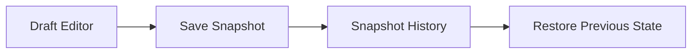

# Memento Pattern in Go

## Complete notes

Memento captures an object's state so it can be restored later without exposing internals.

## Diagram



## Go code

```go
package draft

type Snapshot struct {
    title string
    body  string
}

type Draft struct {
    title string
    body  string
}

func (d *Draft) Update(title, body string) {
    d.title = title
    d.body = body
}

func (d Draft) Save() Snapshot {
    return Snapshot{title: d.title, body: d.body}
}

func (d *Draft) Restore(s Snapshot) {
    d.title = s.title
    d.body = s.body
}
```

## How main calls it

```go
func main() {
    draft := &Draft{}
    draft.Update("old title", "old body")

    snapshot := draft.Save()
    draft.Update("new title", "new body")
    draft.Restore(snapshot)

    fmt.Println(draft.title)
    fmt.Println(draft.body)
}
```

## Example output

```text
old title
old body
```

## Real-life example

A CMS or invoice editor can allow undo: before editing an invoice draft, save a snapshot. If the user cancels, restore the previous state.

## When to use

- undo/redo
- draft editing
- workflow rollback
- game save state
- temporary form changes

## When not to use

Do not use Memento for large objects without thinking about storage/memory cost.

## Interview answer

I would use Memento when I need undo/restore behavior while keeping object internals private.

## Common mistakes

- snapshots are too large
- snapshot exposes mutable internal references
- no limit on history size
