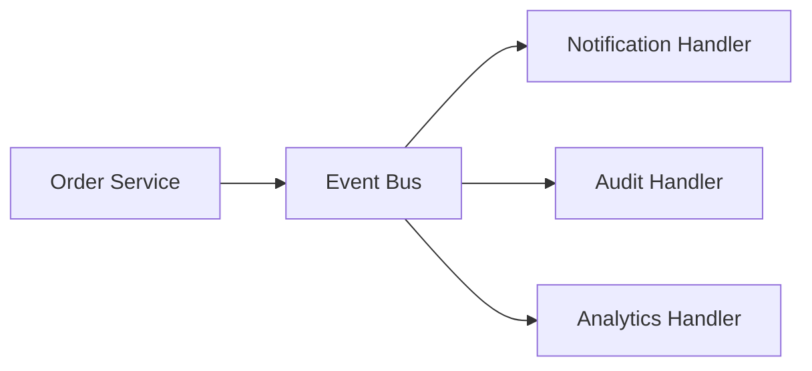

# Observer Pattern in Go

## Complete notes

Observer pattern lets multiple subscribers react when an event happens.

In backend systems, this often becomes event-driven design.

## Diagram



## Go code

```go
package events

import "context"

type Event struct {
    Name    string
    OrderID string
    UserID  string
}

type Handler interface {
    Handle(ctx context.Context, event Event) error
}

type EventBus struct {
    handlers map[string][]Handler
}

func NewEventBus() *EventBus {
    return &EventBus{handlers: make(map[string][]Handler)}
}

func (b *EventBus) Subscribe(eventName string, handler Handler) {
    b.handlers[eventName] = append(b.handlers[eventName], handler)
}

func (b *EventBus) Publish(ctx context.Context, event Event) error {
    for _, handler := range b.handlers[event.Name] {
        if err := handler.Handle(ctx, event); err != nil {
            return err
        }
    }
    return nil
}
```

## How main calls it

```go
type PrintHandler struct{}
func (PrintHandler) Handle(ctx context.Context, event Event) error {
    fmt.Println("handled event:", event.Name, event.OrderID)
    return nil
}

func main() {
    bus := NewEventBus()
    bus.Subscribe("order.created", PrintHandler{})

    _ = bus.Publish(context.Background(), Event{Name: "order.created", OrderID: "order_1"})
}
```

## Example output

```text
handled event: order.created order_1
```

## Real-life example

When an order is placed, the system may need to send notification, write audit log, update analytics, and trigger fulfillment. Observer avoids putting all those responsibilities directly inside `CreateOrder`.

## When to use

- notification after order status changes
- audit logging
- analytics events
- cache invalidation
- async workflows

## When not to use

Do not use Observer when the action is required to complete the main transaction unless you handle failure clearly.

## Interview answer

I would publish an `order.created` event after the order is saved. Notification, audit, and analytics can subscribe independently. For production, I would persist events using an outbox so events are not lost.

## Common mistakes

- no retry handling
- event published before DB transaction commits
- event handlers doing too much synchronously
- no idempotency in event consumers
