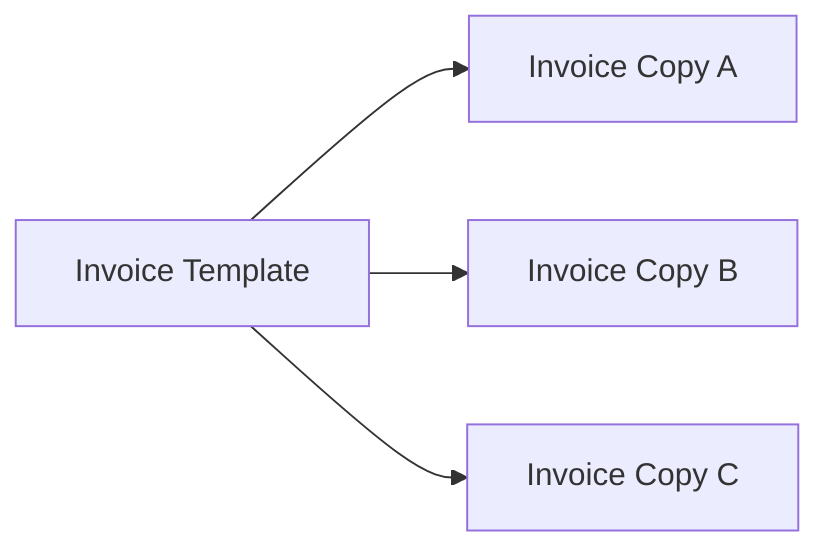

# Prototype Pattern in Go

## Complete notes

Prototype creates new objects by cloning an existing object.

In Go, this usually means implementing a `Clone` method or copy function.

## Diagram



## Go code

```go
package invoice

type LineItem struct {
    Name  string
    Price int64
}

type InvoiceTemplate struct {
    Currency string
    Items    []LineItem
}

func (t InvoiceTemplate) Clone() InvoiceTemplate {
    items := make([]LineItem, len(t.Items))
    copy(items, t.Items)
    return InvoiceTemplate{Currency: t.Currency, Items: items}
}
```

## Real-life example

An invoice app may have recurring invoice templates. Each month, the system clones the template, changes dates and invoice number, and saves a new invoice.

## When to use

- object creation is expensive
- objects start from a template
- recurring invoice/order templates
- game/config objects
- default request/config copies

## When not to use

Do not use Prototype if normal construction is simple or if copying shared mutable state is risky.

## Interview answer

I would use Prototype when new objects are mostly copies of an existing template. In Go, I must be careful to deep copy slices/maps so clones do not share mutable state unexpectedly.

## Common mistakes

- shallow copying slices/maps unintentionally
- clone shares pointers that should be independent
- using prototype instead of a clear constructor
