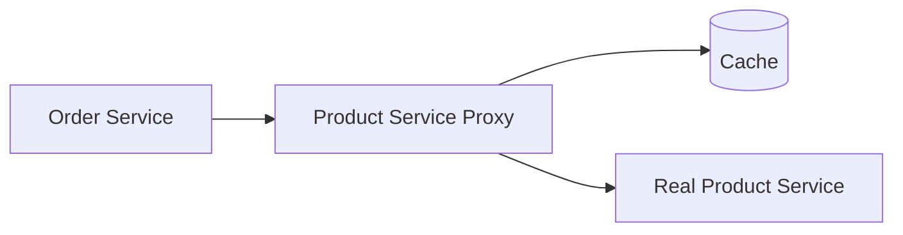

# Proxy Pattern in Go

## Complete notes

Proxy controls access to another object. It can add caching, authorization, lazy loading, logging, or rate limiting.

## Diagram



## Go code

```go
package product

import "context"

type Product struct { ID string; Name string }

type ProductService interface {
    GetProduct(ctx context.Context, id string) (Product, error)
}

type CachedProductService struct {
    real  ProductService
    cache map[string]Product
}

func NewCachedProductService(real ProductService) *CachedProductService {
    return &CachedProductService{real: real, cache: make(map[string]Product)}
}

func (s *CachedProductService) GetProduct(ctx context.Context, id string) (Product, error) {
    if p, ok := s.cache[id]; ok {
        return p, nil
    }
    p, err := s.real.GetProduct(ctx, id)
    if err != nil {
        return Product{}, err
    }
    s.cache[id] = p
    return p, nil
}
```

## How main calls it

```go
type RealProductService struct{}
func (RealProductService) GetProduct(ctx context.Context, id string) (Product, error) {
    fmt.Println("calling real service")
    return Product{ID: id, Name: "Milk"}, nil
}

func main() {
    service := NewCachedProductService(RealProductService{})
    p1, _ := service.GetProduct(context.Background(), "p1")
    p2, _ := service.GetProduct(context.Background(), "p1")

    fmt.Println(p1.Name)
    fmt.Println(p2.Name)
}
```

## Example output

```text
calling real service
Milk
Milk
```

The real service is called once; the second response comes from cache.

## Real-life example

A product service proxy can cache product details so order/cart services do not repeatedly call a slow downstream catalog service.

## When to use

- cache proxy
- auth proxy
- remote service proxy
- lazy-loading proxy
- rate-limited proxy

## When not to use

If the wrapper changes behavior too much, it may be a separate service or decorator instead.

## Interview answer

I would use Proxy when the caller should use the same interface, but access needs extra control like caching or authorization before reaching the real service.

## Common mistakes

- proxy hides failures incorrectly
- stale cache without invalidation
- proxy becomes business logic container
