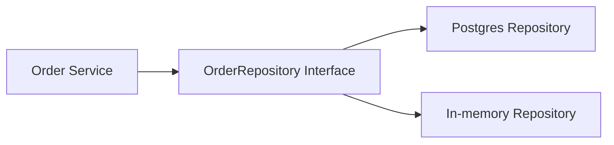

# Repository Pattern in Go

## Complete notes

Repository pattern hides storage details behind an interface.

It is not one of the original GoF patterns, but it is one of the most useful backend LLD patterns.

## Diagram



## Go code

```go
package order

import (
    "context"
    "errors"
)

type Order struct {
    ID     string
    UserID string
    Status string
}

type Repository interface {
    Save(ctx context.Context, order Order) error
    FindByID(ctx context.Context, id string) (Order, error)
}

type InMemoryRepository struct {
    data map[string]Order
}

func NewInMemoryRepository() *InMemoryRepository {
    return &InMemoryRepository{data: make(map[string]Order)}
}

func (r *InMemoryRepository) Save(ctx context.Context, order Order) error {
    r.data[order.ID] = order
    return nil
}

func (r *InMemoryRepository) FindByID(ctx context.Context, id string) (Order, error) {
    order, ok := r.data[id]
    if !ok {
        return Order{}, errors.New("order not found")
    }
    return order, nil
}
```

## Real-life example

In an interview, you can implement `InMemoryRepository` quickly. In production, the same service can use `PostgresOrderRepository` without changing business logic.

## When to use

- service needs storage but should not know SQL details
- you want easy unit tests
- you may swap in-memory for DB later
- you want clear boundary between business and persistence

## When not to use

For tiny scripts or simple CRUD with no business logic, a repository layer may be extra ceremony.

## Interview answer

I would keep storage behind an `OrderRepository` interface. For the interview I can implement in-memory maps. In production this can be backed by Postgres with the same service code.

## Common mistakes

- repository contains business rules
- service contains SQL queries
- one giant repository for all domains
- interface has too many unrelated methods
