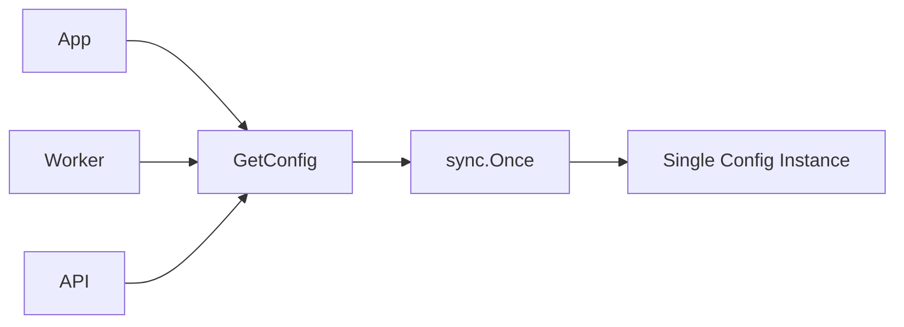

# Singleton Pattern in Go

## Complete notes

Singleton ensures one shared instance exists.

In Go, use it carefully. Prefer explicit dependency injection for testable code. If you need lazy one-time initialization, use `sync.Once`.

## Diagram



## Go code

```go
package config

import "sync"

type Config struct {
    AppName string
    Port    string
}

var (
    instance *Config
    once     sync.Once
)

func GetConfig() *Config {
    once.Do(func() {
        instance = &Config{AppName: "invoiceops", Port: "8080"}
    })
    return instance
}
```

## Real-life example

Configuration loaded once at startup can be singleton-like. A logger can also be shared. But services and repositories should usually be passed explicitly.

## When to use

- config loaded once
- shared logger
- metrics registry
- expensive immutable lookup table

## When not to use

- request-scoped data
- database transactions
- business services that need testing
- anything that changes per tenant/user/request

## Interview answer

I would avoid global singletons for core business services. If I need one-time initialization, I would use `sync.Once`, but still pass dependencies explicitly where possible.

## Common mistakes

- making DB transaction singleton
- hard-to-test global state
- mutable singleton shared across goroutines without locks
- using singleton instead of dependency injection

## Sources

- sync package: https://pkg.go.dev/sync
