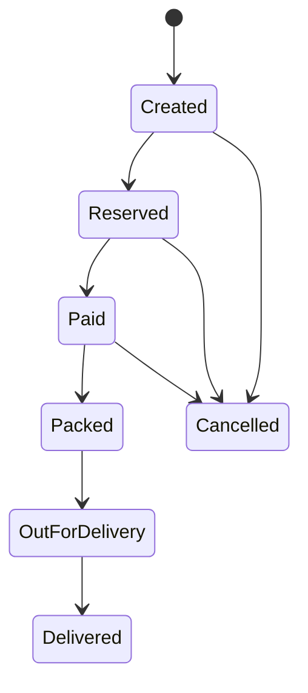

# State Pattern in Go

## Complete notes

State pattern models behavior that changes based on an object's current state.

For backend LLD, it is useful for lifecycle workflows.

## Diagram



## Go code

```go
package order

import "errors"

type OrderStatus string

const (
    Created        OrderStatus = "created"
    Reserved       OrderStatus = "reserved"
    Paid           OrderStatus = "paid"
    Packed         OrderStatus = "packed"
    OutForDelivery OrderStatus = "out_for_delivery"
    Delivered      OrderStatus = "delivered"
    Cancelled      OrderStatus = "cancelled"
)

type Order struct {
    ID     string
    Status OrderStatus
}

func (o *Order) MoveTo(next OrderStatus) error {
    allowed := map[OrderStatus][]OrderStatus{
        Created:        {Reserved, Cancelled},
        Reserved:       {Paid, Cancelled},
        Paid:           {Packed, Cancelled},
        Packed:         {OutForDelivery},
        OutForDelivery: {Delivered},
    }

    for _, status := range allowed[o.Status] {
        if status == next {
            o.Status = next
            return nil
        }
    }
    return errors.New("invalid order state transition")
}
```

## Real-life example

An order cannot go from `created` directly to `delivered`. State transition logic prevents invalid lifecycle movement and makes edge cases easier to discuss.

## When to use

- order lifecycle
- payment lifecycle
- delivery lifecycle
- vending machine
- ticket status
- workflow approval systems

## When not to use

If there are only two states and very simple transitions, a boolean or enum check may be enough.

## Interview answer

I would model order status as a state machine. Each transition is explicit, so invalid transitions are rejected. This is safer than scattering status checks across service methods.

## Common mistakes

- using raw strings everywhere
- allowing any status transition
- hiding state transition rules in UI/client code
- not thinking about cancellation/refund states
