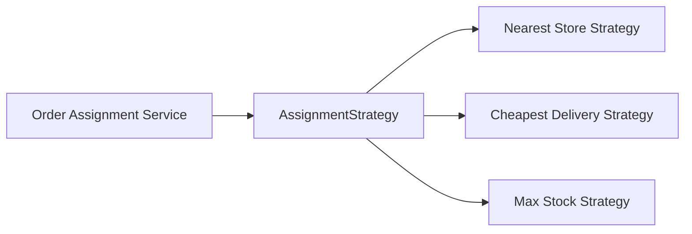

# Strategy Pattern in Go

## Complete notes

Strategy pattern lets you define multiple algorithms behind the same interface and choose one without changing the caller.

Use it when the behavior changes but the service workflow stays the same.

## Diagram



## Go code

```go
package assignment

import (
    "context"
    "errors"
)

type Order struct {
    ID       string
    UserLat  float64
    UserLng  float64
    Items    []OrderItem
}

type OrderItem struct {
    ProductID string
    Quantity  int
}

type Store struct {
    ID       string
    Distance float64
    HasStock bool
}

type StoreSelectionStrategy interface {
    SelectStore(ctx context.Context, order Order, stores []Store) (Store, error)
}

type NearestAvailableStoreStrategy struct{}

func (s NearestAvailableStoreStrategy) SelectStore(ctx context.Context, order Order, stores []Store) (Store, error) {
    var chosen *Store
    for i := range stores {
        if !stores[i].HasStock {
            continue
        }
        if chosen == nil || stores[i].Distance < chosen.Distance {
            chosen = &stores[i]
        }
    }
    if chosen == nil {
        return Store{}, errors.New("no store has stock")
    }
    return *chosen, nil
}

type AssignmentService struct {
    strategy StoreSelectionStrategy
}

func NewAssignmentService(strategy StoreSelectionStrategy) *AssignmentService {
    return &AssignmentService{strategy: strategy}
}

func (s *AssignmentService) Assign(ctx context.Context, order Order, stores []Store) (Store, error) {
    return s.strategy.SelectStore(ctx, order, stores)
}
```

## How main calls it

For practice, put the pattern code and this `main` in the same `package main` file.

```go
func main() {
    service := NewAssignmentService(NearestAvailableStoreStrategy{})

    order := Order{ID: "order_1"}
    stores := []Store{
        {ID: "store_far", Distance: 5.2, HasStock: true},
        {ID: "store_near", Distance: 1.1, HasStock: true},
        {ID: "store_empty", Distance: 0.5, HasStock: false},
    }

    store, err := service.Assign(context.Background(), order, stores)
    if err != nil {
        fmt.Println("error:", err)
        return
    }
    fmt.Println("assigned store:", store.ID)
}
```

## Example output

```text
assigned store: store_near
```

## Real-life example

Zepto may select a dark store by nearest distance today. Later they may use stock confidence, picker load, delivery partner availability, or SLA. Strategy lets you add a new algorithm without rewriting checkout.

## When to use

- pricing rules
- discount calculation
- rate limiting algorithm
- delivery partner matching
- dark store selection
- retry backoff policy

## When not to use

Do not create a strategy if there is only one simple algorithm and no expected variation.

## Interview answer

I would use Strategy because the assignment algorithm can change independently from the order flow. The service depends on `StoreSelectionStrategy`, so adding a new strategy does not change the service code.

## Common mistakes

- using `if strategyType == "x"` everywhere instead of polymorphism
- making the strategy interface too large
- hiding required data inside global variables
