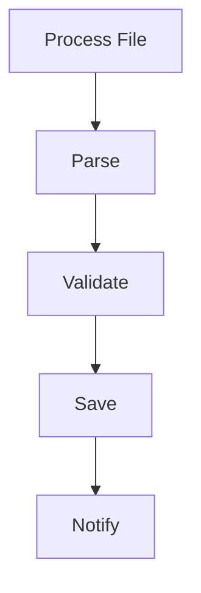

# Template Method Pattern in Go

## Complete notes

Template Method defines the skeleton of an algorithm and lets specific steps vary.

Go does not have inheritance, so implement it with functions or interfaces passed into a workflow.

## Diagram



## Go code

```go
package processor

import "context"

type FileProcessor interface {
    Parse(ctx context.Context, raw []byte) (any, error)
    Validate(ctx context.Context, data any) error
    Save(ctx context.Context, data any) error
}

func ProcessFile(ctx context.Context, p FileProcessor, raw []byte) error {
    data, err := p.Parse(ctx, raw)
    if err != nil { return err }
    if err := p.Validate(ctx, data); err != nil { return err }
    return p.Save(ctx, data)
}
```

## Real-life example

CSV invoice import and JSON invoice import follow the same workflow: parse, validate, save. Only individual steps differ.

## When to use

- import pipelines
- report generation
- payment processing workflow
- file processing
- ETL jobs

## When not to use

If each workflow is completely different, Template Method forces fake similarity.

## Interview answer

In Go, I would implement Template Method as a workflow function that calls an interface for variable steps. This keeps the algorithm order fixed but allows step-specific implementations.

## Common mistakes

- copying Java inheritance version into Go
- too many hooks
- unclear error handling between steps
